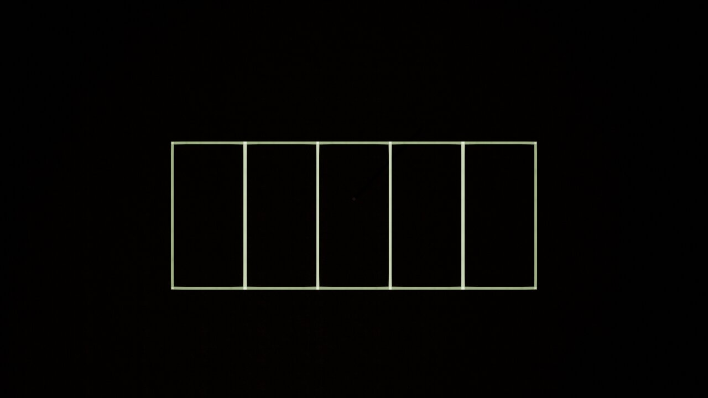

# 주차면 5개 프리셋 생성 (전부 기본값)

- 일시: 2026-07-28 17:45
- 작업 성격: **코드 변경 없음.** 실행 중인 Park3D 인스턴스에 대한 런타임 조작(기존 RPC 기능 사용)
- 경로: Claude MCP 브리지(`park3d-rpc`) → Park3D JSON-RPC 서버(13120)
- 대상 인스턴스: **패키지 exe** `Package/Windows/Park3D.exe` (에디터 PIE 아님)

---

## 1. 요청 해석

"주차면 5개짜리를 **기본 값으로** 만들어줘"

→ `preset.create`에서 **필수 파라미터만 주고 나머지는 전부 서버 기본값**에 맡긴다.
(직전 6개 작업 `20260726_233442`은 `xSize`/`zSize`/`dirType` 등을 명시했던 것과 대비된다.)

## 2. 기본값 근거 (`PresetRpcModule.cpp:106-131`)

`preset.create`의 필수/선택 구분:

| 파라미터 | 필수 여부 | 기본값 | 근거 |
|---|---|---|---|
| `offset` | **필수** | — | `RequirePosXZ` — 없으면 에러 |
| `faceCount` | **필수** | — | `RequireInt` — 없으면 에러 |
| `faceRot` | 선택 | `0.0` | `GetFloat(P,"faceRot",0.0)` |
| `groupRot` | 선택 | `0.0` | `GetFloat(P,"groupRot",0.0)` |
| `dirType` | 선택 | `0` (`EFaceDirType::Default`) | `GetInt(P,"dirType",0)` |
| `camIdx` | 선택 | `1` | `GetInt(P,"camIdx",1)` |
| `useBaseWidth` | 선택 | `true` | `GetBool(P,"useBaseWidth",true)` |
| `xSize` | 선택 | `2.5` (m) | `GetFloat(P,"xSize",2.5)` |
| `zSize` | 선택 | `5.0` (m) | `GetFloat(P,"zSize",5.0)` |
| `presetName` | 선택 | `Preset_%03d` | `Printf(TEXT("Preset_%03d"), NewIdx)` |

즉 **RPC 기본값이 곧 표준 주차면 규격 2.5 m × 5 m**이며, 6개 작업에서 명시했던 값과 동일하다.

> 참고: `FParkingPreset::FaceCount`의 C++ 구조체 기본값은 `7`이지만(`ParkingPresetTypes.h:34`), `preset.create`는 `faceCount`를 **필수**로 받으므로 이 7은 RPC 경로에서 쓰이지 않는다.

## 3. 사전 상태

| 호출 | 결과 |
|---|---|
| `preset.list` | `[]` — 등록된 프리셋 없음 → 신규 `idx=1` |
| `map.get` | `sizeX=160, sizeZ=160` (m) |

## 4. 실행

```json
// method: preset.create   ← 필수 2개만. 나머지 전부 생략(기본값)
{
  "offset":    { "x": 0, "y": 0, "z": 0 },
  "faceCount": 5
}
```

응답:

```json
{
  "idx": 1, "presetName": "Preset_001", "faceCount": 5,
  "offsetPos": { "x": 0, "y": 0, "z": 0 },
  "faceRot": 0, "groupRot": 0,
  "xSize": 2.5, "zSize": 5,
  "dirType": 0, "useBaseWidth": true, "camIdx": 1
}
```

전체 배열 폭 = 2.5 × 5 = **12.5 m**, 길이 5 m. 160 × 160 m 맵 안에 여유 있게 들어간다.

`preset.rebuildAll`은 **호출하지 않았다.** `preset.create`가 내부에서 `Mgr->RefreshView()`를 이미 부르며, `rebuildAll`은 `showQubeBox`를 무조건 대입하므로(`PresetRpcModule.cpp:336`) 부르면 오히려 현재 뷰 모드를 바꾼다. "기본값으로" 요청이므로 뷰 플래그를 건드리지 않았다.

## 5. 검증

| 검증 | 호출 | 결과 | 판정 |
|---|---|---|---|
| 생성값 반영 | `preset.create` 응답 | faceCount 5, xSize 2.5, zSize 5, dirType 0, camIdx 1 | 통과 |
| 저장 상태 재조회 | `preset.get {idx:1}` | 응답과 동일 | 통과 |
| **면 인식** | `preset.renumber` | `startFaceNum=1, faceCount=5, faceNumbers=[1,2,3,4,5]` | 통과 |
| **시각 확인** | `cam.captureJPG` | 슬롯 5칸, 각 칸 세로:가로 ≈ 2:1 | 통과 |

`preset.renumber`가 1~5를 반환한 것은 `UParkingGeometryLibrary`가 실제로 5개 면을 인식했다는 뜻이다.

### 5-1. 시각 확인 (직전 6개 작업의 미검증 항목 해소)

`20260726_233442` 문서는 "카메라가 없어 캡처 불가"로 시각 확인을 미검증으로 남겼다. 이번에는 카메라를 배치해 **탑뷰 캡처로 5칸을 눈으로 확인**했다.



- 칸 수: **5개** (세로 구분선 4개)
- 각 칸 화면 비율 ≈ 131 px × 260 px = **1 : 2** → 실제 2.5 m × 5 m 비율과 일치
- 데칼(2D 바닥선) 모드로 렌더됨 — `20260727_095211` 문서의 데칼 결선이 패키지 exe에서도 동작함을 확인

### 5-2. 카메라 축 매핑 (캡처 시 참고)

탑뷰(`tilt=90`) 캡처에서 화면 축과 월드 축의 대응을 실측 역산했다. 세 번의 캡처(카메라 위치를 바꿔가며) 결과로 연립해 얻은 관계:

```
image_x = 640 + (slot_y - cam_y) * s      ← 화면 가로 = 월드 y
image_y = 360 - (slot_x - cam_x) * s      ← 화면 세로 = 월드 x (부호 반대)
s ≈ 41.2 px/m  @ height 28 m  (s ∝ 1/height)
```

**화면 가로가 월드 x가 아니라 y**라서, 처음에 `cam.setPosition {x:6.25, y:2.5}`로 잡았을 때 프리셋이 화면 아래로 잘려 나갔다. 역산으로 얻은 프리셋 중심 ≈ `(x=0.6, y=5.0)`에 카메라를 두니 정중앙에 들어왔다.

최종 캡처 설정: `cam.setPosition {camId:1, pos:{x:0.57, y:5, z:22}}`, `cam.setPTZ {pan:0, tilt:90, zoom:1}`

## 6. 영향도 분석

- **코드/빌드 영향 없음** — 소스 수정·컴파일 없음.
- **런타임 상태 변경**:
  - `AParkingPresetManager::StoredPresets`에 항목 1개 추가, `RefreshView()` 1회.
  - 뷰 플래그(`bShow3DView` / `bUseDecalView` / `DecalLineThicknessCm`)는 **변경하지 않음**(rebuildAll 미호출).
  - 검증용 카메라 `camId=1`의 위치·PTZ가 변경됨. 원래 값은 `pos(0,0,0), pan 0, tilt 0`이었다.
- **후속 기능 연동**: 프리셋은 주차면 번호(`camIdx` → `startFaceNum`) 체계의 입력이므로, 이후 `random.slotPlace` / `random.placeInView` 계열 차량 배치가 이 **5개 슬롯**을 대상으로 동작한다. 기존 프리셋이 0개였으므로 번호 충돌·재할당 회귀는 없다.
- **되돌리기**: `preset.delete {idx:1}` 또는 `preset.clear`.

## 7. 미검증 / 주의

- **디스크 저장 안 함.** 매니저 메모리에만 존재한다. **패키지 exe를 닫으면 사라진다.** 남기려면:
  ```
  preset.save   (기본 경로 Park3D/Save/3D/Preset/preset.json)
  ```
  요청 범위를 넘는 파일 쓰기라 수행하지 않았다.
- **에디터 PIE에는 없다.** 이번 작업 대상은 패키지 exe 인스턴스다. 에디터에서 쓰려면 `preset.save` 후 에디터 PIE에서 `preset.load`.

## 8. 참고 파일

- `Park3D/Source/Park3D/Rpc/Modules/PresetRpcModule.cpp:106` — `preset.create` 기본값 정의
- `Park3D/Source/Park3D/ParkingPresetTypes.h:32-55` — `FParkingPreset` 필드·단위 규약
- `Docs/20260726_233442_프리셋메이커_주차면6개_프리셋생성.md` — 직전 6개 작업(값 명시 방식)
- `Docs/20260727_095211_프리셋_2D바닥데칼_렌더_결선.md` — 데칼 렌더 경로
