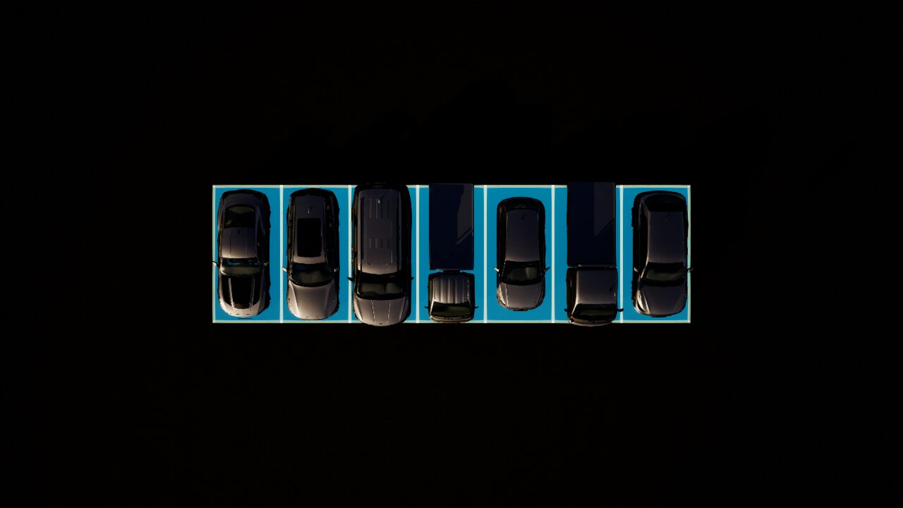
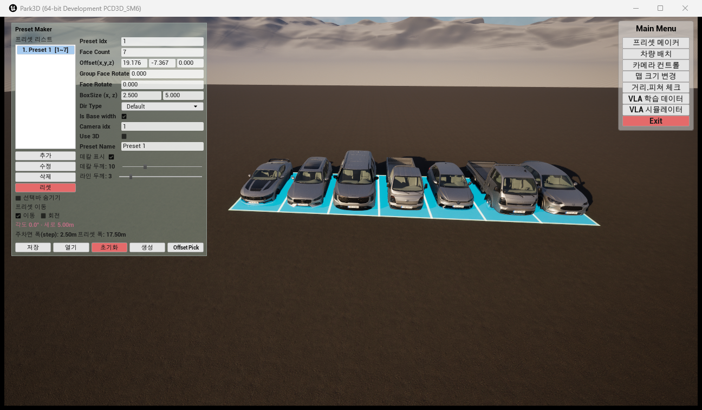

# 주차면 7개에 차량 7대 랜덤 배치 + UI/RPC 프리셋 목록 이원화 문제

- 일시: 2026-07-28 18:30
- 작업 성격: 코드 변경 없음. 실행 중인 패키지 exe에 대한 런타임 조작
- 대상: `Package/Windows/Park3D.exe` (PID 22856, RPC 13120)

---

## 1. 요청과 최초 불일치

요청: "현재화면에 주차면 7개가 있다. 차량 7대를 랜덤으로 배치해줘."

그런데 RPC 조회 결과가 화면과 달랐다.

| | 화면 UI (Preset Maker) | RPC `preset.list` |
|---|---|---|
| 프리셋 이름 | `Preset 1` | `Preset_001` |
| Face Count | **7** (`[1~7]`, 프리셋 폭 17.50 m) | **5** |
| Offset | `19.176, -7.367, 0` | `0, 0, 0` |

인스턴스 오인이 아님을 먼저 확인했다.

- 실행 중 프로세스: 패키지 exe(PID 22856) + 에디터(PID 9868). **에디터는 PIE 미실행**(로그에 EOS 하트비트만, RPC 포트 없음).
- 13120 리슨 = 패키지 exe. 즉 **RPC와 화면은 같은 프로세스**인데 값이 달랐다.

## 2. 원인 — 프리셋 목록이 두 벌이다 (핵심)

`AParkingPresetManager` 액터는 하나지만, **프리셋 데이터 소스가 두 개**다.

| 경로 | 데이터 | 렌더 트리거 |
|---|---|---|
| **UI(위젯)** | `UPresetMakerWidget::Presets` (`PresetMakerWidget.h:88`) | 위젯이 `Mgr->RebuildAll(Presets, ...)`를 **인자로 넘겨** 호출 |
| **RPC** | `AParkingPresetManager::StoredPresets` | `Mgr->RefreshView()`가 `StoredPresets`로 재빌드 (`ParkingPresetManager.cpp:285-290`) |

`RebuildAll(const TArray<FParkingPreset>& Presets, ...)`가 목록을 **파라미터로 받는** 구조라, 위젯은 자기 목록을 그대로 넘겨 그리고 RPC는 매니저 내부 `StoredPresets`로 그린다. 서로를 모른다.

**결과**:
- UI에서 만들거나 "열기"로 로딩한 프리셋은 **RPC에 안 보인다**.
- RPC로 만든 프리셋은 **UI 목록에 안 뜬다**.
- 나중에 그린 쪽이 화면을 차지한다.

> **주의**: 이 상태에서 `preset.*` 변경 메서드(create/delete/update/clear/rebuildAll)를 호출하면 매니저가 `StoredPresets` 기준으로 다시 그려서 **UI가 띄운 주차면이 화면에서 사라진다.** 이번 작업에서 `preset.*` 변경 호출을 전부 피한 이유다.

## 3. 두 번째 제약 — 랜덤 배치 전용 메서드 미구현

| 메서드 | 상태 |
|---|---|
| `random.slotPlace` | **-32000** "주차면 슬롯(CFaceRect) 백엔드 없음" |
| `random.placeInView` | **-32000** "PTZ 뷰포트 배치 백엔드 없음" |
| `random.slotJitter` / `random.frontBack` / `random.randomizeAll` | **-32000** |
| `random.recreateCars` | 실동작 — 위치 보존 + **차종 랜덤 재생성** |

(`RandomRpcModule.cpp:129-148`)

### `car.createLine`도 쓸 수 없었다

`car.createLine`은 `SpawnRandomCarsInLine`으로 차종을 랜덤 추첨해 일렬 배치하므로 후보였으나, **진행 축이 맞지 않는다.**

- 슬롯 진행: `Pos.Y += Step * FaceIndex` → **+Y** (`ParkingPresetManager.cpp:88`, `bIsBaseWidth=true`, `DirType=Default`)
- `car.createLine` 진행: RPC가 `RightDir`에 **영벡터**를 넘김 → `AutoPlacePosition`의 폴백으로 **항상 +X** (`CarPlacementLibrary.cpp:93-98`). `vertical=true`도 +X.

축이 90° 어긋나므로 슬롯 위에 못 얹는다. → **슬롯 중심을 직접 계산해 `car.create` 7회**로 우회했다.

## 4. 슬롯 중심 좌표 도출

`ComputeSlotCorners`(`ParkingPresetManager.cpp:55-116`) 기준:

- `Origin = P.Offset`
- `Step = BoxSizeX = 2.5 m` (`bIsBaseWidth=true`)
- `FaceRotate=0` → `bReverseStep=false`, `GroupFaceRotate=0` → 그룹 회전 없음
- `DirType=Default` + `bIsBaseWidth` → `Pos.Y += Step * FaceIndex`
- 코너 4개가 `Pos` 중심 대칭 → **`Pos`가 곧 슬롯 중심**

```
슬롯 i 중심(m) = ( 19.176 , -7.367 + 2.5·i , 0 )    i = 0..6
```

| i | y |
|---|---|
| 0 | -7.367 |
| 1 | -4.867 |
| 2 | -2.367 |
| 3 | 0.133 |
| 4 | 2.633 |
| 5 | 5.133 |
| 6 | 7.633 |

**사전 검증**: 배치 전에 계산한 중심 `(19.176, 0.133)` 위에 카메라를 놓고 캡처 → 7칸이 정확히 정중앙에 들어옴을 확인한 뒤 차량을 만들었다.

## 5. 실행

```jsonc
// 1) 슬롯 중심마다 car.create × 7
{ "pos": { "x": 19.176, "y": <위 표의 y>, "z": 0 }, "presetId": 1, "rotY": 180 }

// 2) 차종 랜덤화(위치 보존)
random.recreateCars { "randomCreate": true, "seed": 20260728 }
```

`prefabId`를 직접 추첨하지 않고 `random.recreateCars`에 맡긴 이유: 프리팹 id 규약(진법·유효 범위)을 추측하면 회귀 위험이 있고, `RebuildAllRandomMesh`가 내부 Catalog로 정당하게 추첨하기 때문이다.

## 6. 검증

| 검증 | 결과 | 판정 |
|---|---|---|
| 차량 수 | `car.list` → 7대 | 통과 |
| 위치 정확도 | 7대 모두 `x=19.176`, y가 계산표와 일치 | 통과 |
| **차종 랜덤** | prefabId `15, 13, 11, 22, 16, 7, 23` — **7대 전부 다른 차종** | 통과 |
| `random.recreateCars` | `carCount=7, seedHonored=true` | 통과 |
| 탑뷰 렌더 | 7칸에 7대, 각 칸 중앙 정렬 | 통과 |
| **실제 사용자 화면** | 창 캡처로 7대 배치 확인, Preset Maker UI 값(Face Count 7, Offset) 그대로 유지 | 통과 |





## 7. 영향도 분석

- **코드/빌드 영향 없음** — 소스 수정·컴파일 없음.
- **런타임 상태 변경**:
  - `ACarPlacementManager`에 차량 액터 7개 추가(`carNameId` `0-18.27.14` ~ `6-18.27.27`).
  - `random.recreateCars`가 7대를 **전부 재생성**했다(기존 액터 파기 후 새 메시로 스폰). 위치·rotY·presetId는 `ToCarPosDatas()`로 보존됨.
  - 검증용 카메라 `camId=1`의 위치·PTZ 변경.
  - **프리셋 매니저는 건드리지 않음** — `preset.*` 변경 메서드 미호출로 UI가 그린 7면 데칼 유지.
- **되돌리기**: `car.deleteAll` 또는 개별 `car.delete {carNameId}`.

## 8. 남은 문제 / 미검증

1. **`slotId = -1`**. `car.create`로 만든 차량은 슬롯 미배정(노이즈 후보)이다(`CarRpcModule.cpp:54`). 이후 `random.recreateCars`가 위치를 보존하지만 slotId는 `ToCarPosDatas()`가 넘긴 값을 따른다. 시각적으로는 슬롯 위에 있으나 **데이터상 "7번 슬롯에 주차된 차"로 인식되지는 않는다.** 슬롯 귀속이 필요하면 `random.slotPlace` 구현이 선행돼야 한다.
2. **`prefabName`이 빈 문자열**. `car.list` 응답의 `prefabName`이 모두 비어 있다. `PrefabNameFromId(Catalog, id)`가 매칭에 실패한 것으로 보인다. 메시는 정상 스폰됐으므로 표시용 필드만의 문제일 가능성이 크나 **미조사**.
3. **`StoredPresets`에 5면 프리셋이 남아 있다.** 이전 작업에서 RPC로 만든 `Preset_001`(5면, 원점)이 그대로다. 지우려면 `preset.delete`를 불러야 하는데 그 호출이 `RefreshView()`를 유발해 **UI가 그린 7면 데칼을 지운다.** 그래서 손대지 않았다.
4. **디스크 저장 안 함.** 차량·프리셋 모두 메모리에만 있다. exe를 닫으면 사라진다. 남기려면 `car.save` / UI의 "저장".

## 9. 참고 파일

- `Park3D/Source/Park3D/PresetMakerWidget.h:88` — 위젯 자체 프리셋 목록
- `Park3D/Source/Park3D/ParkingPresetManager.cpp:55-116` — `ComputeSlotCorners`(슬롯 중심 규약)
- `Park3D/Source/Park3D/ParkingPresetManager.cpp:279-292` — `RefreshView`(StoredPresets 기준 재빌드)
- `Park3D/Source/Park3D/Rpc/Modules/RandomRpcModule.cpp:129-148` — 미구현 랜덤 메서드
- `Park3D/Source/Park3D/CarPlacementLibrary.cpp:83-99` — `AutoPlacePosition`(+X 고정)
- `Park3D/Source/Park3D/CarPlacementManager.cpp:266-298` — `SpawnRandomCarsInLine`
