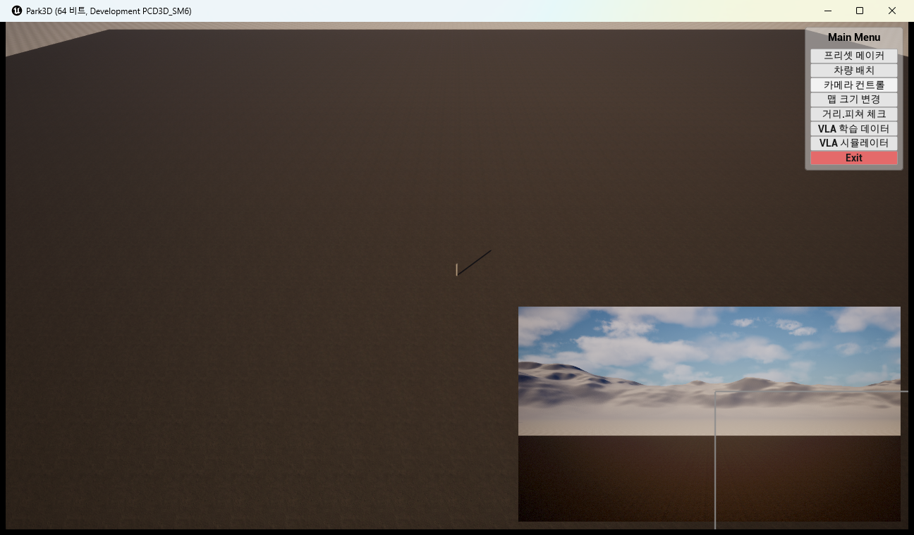
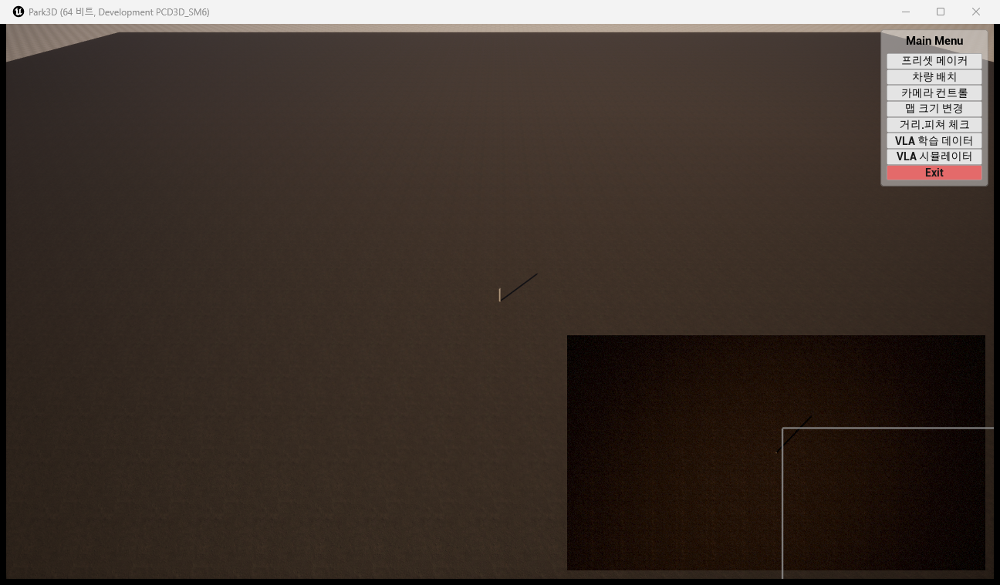

# 카메라 뷰(렌더타겟) 상시 표시 — 컨트롤 패널 의존 제거

- 작성일시: 2026-07-28 19:15
- 작성자: Claude Code (Opus 5) / 설계·구현·QA·문서 직접 수행
- 설계서: `_workspace/camviewer_always_architect_design.md`
- 빌드 로그: `_workspace/camviewer_always_build2.log`
- 테스트 로그: `Park3D/Saved/Logs/Park3D.log` (Automation 실행분)
- 스크린샷: `Docs/shots/20260728_camviewer_panelclosed.png`, `Docs/shots/20260728_camviewer_camswitch.png`

---

## 1. 요청

카메라 뷰(렌더타겟 프리뷰)가 **카메라 컨트롤 대화상자가 열려 있을 때만** 보인다. **항상 보이도록** 변경한다.

## 2. 원인 — 두 군데

| # | 원인 | 위치(변경 전) |
|---|---|---|
| A | 패널이 뷰포트에서 내려갈 때 뷰어를 함께 제거 | `UCameraControlWidget::NativeDestruct()` |
| B | **뷰어의 생성 주체가 컨트롤 패널**이라, 패널을 한 번도 열지 않으면 뷰어가 존재하지 않음 | `UCameraControlWidget::EnsureViewer()` |

A만 고치면 "한 번 열었다 닫아야 계속 보임"이 되어 요구를 절반만 만족한다. B까지 고쳐야 진짜 상시 표시가 된다.

추가로, 브러시 갱신(`RefreshViewerBrush`)을 **컨트롤 패널만 호출**하고 있었다. 패널이 닫힌 상태에서 RPC `cam.select` / `cam.create` 등으로 선택 카메라가 바뀌면 뷰어가 낡은 화면을 잡고 있게 되므로, 이 경로도 함께 해결해야 기능이 성립한다.

## 3. 설계 결정

소유자를 **`APark3DGameMode`**로 옮겼다. 대안 4개를 비교했고(설계서 §3), 채택 근거는 다음과 같다.

- `Park3DGameMode.cpp`가 이미 `AMapFloorActor::GetOrSpawn`을 **"패널을 한 번도 열지 않아도 바닥은 존재한다"**는 이유로 `BeginPlay`에서 보장하고 있다.
- 상시 UI인 Main Menu(`ShowMenu`)도 같은 자리에 있다.
- 즉 "패널과 무관하게 상시 존재해야 하는 것"의 기존 소유자가 GameMode다. 관례와 일치.

`ACameraControlManager`(액터)가 UI를 소유하는 구조나 static 싱글턴은 각각 소유 역전·PIE 세션 잔존 위험으로 배제했다.

### 사전 확인한 위험

설계서에 "BP 게임모드가 `APark3DGameMode`를 상속하지 않으면 뷰어가 안 뜬다"는 위험을 적고 구현 전에 확인했다.

- `Content/UI/BP_PresetGameMode.uasset`의 부모는 `/Script/Engine.GameModeBase` — **`APark3DGameMode` 미상속(미사용 레거시)**
- `PresetMaker1.umap`에 GameMode 오버라이드 문자열 없음 → `DefaultEngine.ini`의 `GlobalDefaultGameMode=/Script/Park3D.Park3DGameMode` 적용
- 실행 로그로 최종 확인: `LogLoad: Game class is 'Park3DGameMode'`

`WBP_CameraViewer`의 부모가 `/Script/Park3D.CameraViewerWidget`인 것도 사전 확인했다(`FClassFinder<UCameraViewerWidget>` 성립 조건).

## 4. 변경 파일

| 파일 | 차수 | 내용 |
|---|---|---|
| `Park3DGameMode.h` | 수정 | `ViewerWidgetClass`, `GetCameraViewer()`, `ShowCameraViewer()`, `ViewerWidget` 추가 |
| `Park3DGameMode.cpp` | 수정 | 생성자에서 `/Game/UI/WBP_CameraViewer` 조회, `BeginPlay`에서 `ShowCameraViewer()` 호출, 구현 추가 |
| `CameraControlWidget.cpp` | 수정 | `NativeDestruct`의 뷰어 제거 삭제, `EnsureViewer`가 GameMode 인스턴스를 조달(폴백 유지) |
| `CameraViewerWidget.h/.cpp` | 수정 | `NativeTick` 폴링 추가, `SetRenderTarget`의 null 처리 확장 |
| `Tests/CameraViewerWidgetTest.cpp` | 수정 | `Park3D.CameraViewer.RenderTargetVisibility` 유닛테스트 추가 |

### 4-1. GameMode가 뷰어를 소유

```cpp
// 생성자 — MenuWidgetClass 와 동일 패턴
static ConstructorHelpers::FClassFinder<UCameraViewerWidget> ViewerFinder(TEXT("/Game/UI/WBP_CameraViewer"));
if (ViewerFinder.Succeeded()) { ViewerWidgetClass = ViewerFinder.Class; }

// BeginPlay
ShowMenu();
ShowCameraViewer();   // 추가 — 패널을 한 번도 열지 않아도 존재
```

`AddToViewport(5)`로 기존 ZOrder 규약(뷰어 5 < 컨트롤 패널 10 < 메뉴 100)을 그대로 유지했다.

### 4-2. 컨트롤 패널은 "소유"에서 "사용"으로

```cpp
// EnsureViewer — GameMode 인스턴스를 받아 쓴다
if (!ViewerInstance)
{
    if (APark3DGameMode* GM = Cast<APark3DGameMode>(UGameplayStatics::GetGameMode(this)))
        ViewerInstance = GM->GetCameraViewer();
}
// 폴백: 커스텀 BP 게임모드면 종전대로 패널이 직접 생성(하위 호환, 이 경로는 패널을 열어야 보임)
```

`NativeDestruct`의 `ViewerInstance->RemoveFromParent()`는 삭제했다. 거리 대화상자(`DistanceDialogInstance`) 제거는 요청 범위 밖이라 **그대로 두었다**.

### 4-3. 뷰어의 자립적 렌더타겟 추종

```cpp
void UCameraViewerWidget::NativeTick(...)
{
    if (!CachedManager.IsValid())
        CachedManager = Cast<ACameraControlManager>(
            UGameplayStatics::GetActorOfClass(World, ACameraControlManager::StaticClass()));

    UTextureRenderTarget2D* RT = Mgr ? Mgr->GetSelectedRenderTarget() : nullptr;
    if (RT != AppliedRT.Get()) { SetRenderTarget(RT); }  // 바뀔 때만 브러시 재생성
}
```

- 매니저를 약참조로 캐시해 매 프레임 `GetActorOfClass`(전체 액터 순회)를 피한다.
- 매니저가 없으면 **스폰하지 않는다**(뷰어가 매니저를 만드는 소유 역전 방지). RT는 null로 둔다.

### 4-4. 표시할 카메라가 없을 때

`SetRenderTarget(nullptr)`이 종전에는 그냥 return이라 빈 사각형과 외곽 프레임만 남았다. 이제 `Img_View`를 `Collapsed`로 접는다. 외곽 프레임은 `NativePaint`가 `Img_View` 지오메트리 크기로 그리므로 Collapsed면 크기 0이 되어 함께 사라진다(별도 분기 불필요).

> **해석 가정**: "항상 보인다"를 *컨트롤 패널과 무관하게 보인다*로 해석했다. 보여줄 카메라가 0대일 때 빈 사각형을 띄우는 것은 의도가 아니라고 판단해 숨겼고, 카메라가 생기면 즉시 나타난다.

## 5. 검증

### 5-1. 빌드

에디터 실행 중에는 `Unable to build while Live Coding is active`로 실패했다. 에디터와 패키지 exe를 종료한 뒤 재빌드했다.

```
[1/8] Compile CameraViewerWidgetTest.cpp
[2/8] Compile Park3DGameMode.cpp
[3/8] Compile CameraViewerWidget.cpp
[4/8] Compile CameraControlWidget.cpp
[7/8] Link UnrealEditor-Park3D.dll
Result: Succeeded (19.17초)
```

디스크 DLL을 실제로 교체했으므로 Live Coding 상태로 헤드리스 테스트를 돌릴 때 신규 테스트가 조용히 누락되는 함정을 피했다.

### 5-2. Automation 유닛테스트

```
UnrealEditor-Cmd.exe Park3D.uproject -ExecCmds="Automation RunTests Park3D;Quit" -unattended -nullrhi
```

| 항목 | 결과 |
|---|---|
| 총 테스트 | **45개** |
| 실패 | **0개** |
| 신규 `Park3D.CameraViewer.RenderTargetVisibility` | **Success** (실행 확인) |
| 기존 `Park3D.CameraViewer.SizeRoundTrip` 회귀 | **Success** |

신규 테스트 검증 내용: RT 없음 → `Collapsed` / RT 있음 → `Visible` + 브러시 리소스가 해당 RT / 다시 해제 → `Collapsed`.

### 5-3. 실동작 (Play, `-game`)

| # | 시나리오 | 결과 | 판정 |
|---|---|---|---|
| 1 | 부팅 시 GameMode가 뷰어 생성 | 로그 `[Park3DGameMode] 카메라 뷰어를 뷰포트에 표시했습니다.` — Main Menu와 같은 프레임(`[ 0]`), 패널보다 먼저 | 통과 |
| 2 | GameMode 클래스 확인 | 로그 `Game class is 'Park3DGameMode'` | 통과 |
| 3 | **메뉴에서 카메라 컨트롤 패널을 닫음** | 패널·거리창은 사라지고 **뷰어는 우하단에 그대로 유지** | 통과 |
| 4 | **패널이 닫힌 채 RPC `cam.select`로 카메라 전환** | 뷰어 내용이 카메라1(수평·하늘)에서 카메라2(25m 수직 하향·지면)로 **변경됨** | 통과 |

3번이 요청의 핵심이고, 4번은 자립 폴링이 실제로 동작함을 보인다.





### 5-4. 미검증

- **카메라 0대 상태의 런타임 표시**: 마지막 카메라 1대는 `cam.delete`가 조용히 실패하는 기존 동작 때문에 런타임에서 0대를 만들 수 없었다. 해당 경로는 **유닛테스트(5-2)로만 검증**했다.
- **패키지 exe 반영**: 이번 빌드는 에디터 타깃(`Park3DEditor`)이다. 배포본에 반영하려면 재패키징이 필요하다.

## 6. 영향도 분석 (사후)

| 대상 | 영향 | 위험 |
|---|---|---|
| `Park3D.Build.cs` / 모듈 의존성 | 변경 없음(UMG·Engine 기존 의존만 사용) | 없음 |
| `WBP_CameraViewer` / `WBP_CameraControl` 에셋 | **변경 없음.** `WBP_CameraControl`의 `ViewerWidgetClass` 기본값은 폴백 경로로 계속 유효 | 없음 |
| 뷰어의 이동·리사이즈·크기 영속화(`ViewerSize.json`) | 로직 미변경. `SizeRoundTrip` 테스트 통과로 회귀 없음 확인 | 없음 |
| 컨트롤 패널의 `RefreshViewerBrush` | 유지. 패널이 열려 있으면 폴링과 같은 RT를 중복 지정하나 값이 같아 무해 | 낮음 |
| 거리 측정 대화상자 | `NativeDestruct`의 해당 제거 로직 유지 — 패널 닫으면 종전대로 함께 닫힘 | 없음 |
| RPC `cam.*` | 변경 없음. 매니저만 다루며 뷰어를 모름. 오히려 패널 없이도 RPC 결과가 화면에 반영됨 | 없음 |
| 성능 | 뷰어에 매 프레임 틱 추가. 실제 작업은 약참조 유효성 검사 + 포인터 비교뿐이며, `GetActorOfClass`는 캐시 무효 시에만 수행 | 낮음 |

### 동작 변화(의도된 것이나 알아둘 점)

**뷰어를 숨길 수단이 없어졌다.** 종전에는 컨트롤 패널을 닫으면 뷰어도 사라져서 사실상 그것이 숨김 조작이었다. 이제는 카메라가 있는 한 항상 표시된다. 숨김/표시 토글이 필요하면 Main Menu에 별도 항목을 추가하는 후속 작업이 필요하다.

## 7. 참고 파일

- `Park3D/Source/Park3D/Park3DGameMode.cpp` — 상시 위젯·액터 보장 지점(`ShowMenu`, `ShowCameraViewer`, `MapFloorActor::GetOrSpawn`)
- `Park3D/Source/Park3D/CameraControlWidget.cpp` — `EnsureViewer` / `NativeDestruct`
- `Park3D/Source/Park3D/CameraViewerWidget.cpp` — `NativeTick` 폴링, `SetRenderTarget`
- `Park3D/Source/Park3D/CameraControlManager.cpp:91` — `GetSelectedRenderTarget`
- `_workspace/camviewer_always_architect_design.md` — 설계서(대안 비교 포함)
