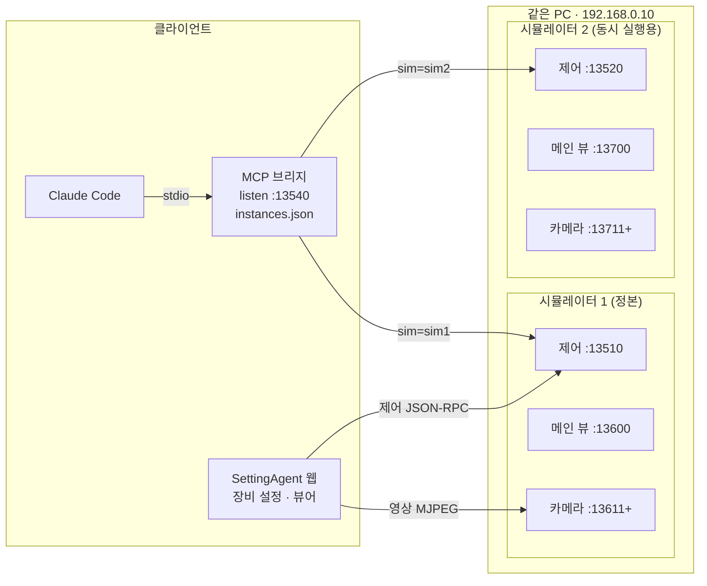
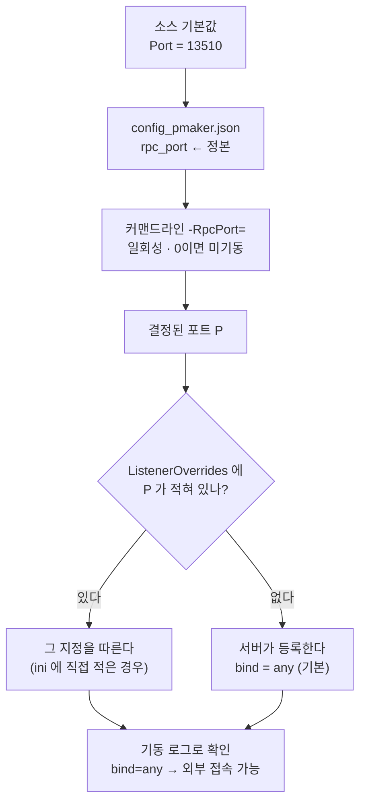

# Park3D 포트 구조와 카메라 컨트롤 패널 — 최종 정리와 사용법

- 작성: 2026-08-17 12:27
- 대상 독자: 이 PC(또는 같은 구성)에서 Park3D 시뮬레이터를 띄우고 SettingAgent·MCP 로 붙이는 사람
- 관련 문서: `Docs/20260816_233952_카메라컨트롤_PTZ패드_추가.md`,
  `Docs/20260817_112836_RPC_외부연결실패_포트박힌바인드override.md`

---

## 1. 포트 — 한눈에

한 인스턴스가 여는 포트는 **제어 1개 + 영상(메인 뷰 1 + 카메라 N)** 이다.

| 용도 | 시뮬 1 (정본) | 시뮬 2 | 정하는 곳 |
|------|--------------|--------|-----------|
| 제어 · JSON-RPC `POST /rpc` | **13510** | **13520** | `config_pmaker.json` → `rpc_port` |
| 메인 뷰 영상 · MJPEG | **13600** | **13700** | `config_pmaker.json` → `main_port` |
| 카메라 영상 · MJPEG (camId 1부터) | **13611–13650** | **13711–13750** | `config_pmaker.json` → `cam_port_min`/`cam_port_max` |
| MCP 브리지 자신의 http 리슨 | **13540** (인스턴스와 무관하게 하나) | | 환경변수 `PARK3D_MCP_PORT` |

규칙은 두 줄이다.

- **제어 포트는 인스턴스마다 +10**
- **영상 포트는 +100** — 카메라 수만큼 연속으로 자리를 먹으므로 간격이 넓어야 한다

카메라 포트 계산: `camId N 의 포트 = cam_port_min + (N - 1)`.
즉 시뮬 1 에서 `camId 1 = 13611`, `camId 2 = 13612`.

> **포트가 사는 곳은 `Save/Config/config_pmaker.json` 하나다.**
> `DefaultGame.ini` 에는 포트가 없다 — 패키지에는 그 ini 파일 자체가 존재하지 않아서(빌드 시 바이너리 설정으로
> 구워진다) 거기 적어 봐야 재패키지 없이는 못 바꾸고, 화면에만 남아 사람을 헷갈리게 한다.
> 소스 기본값(13510 / 13600 / 13601~)은 config 가 없을 때만 쓰인다.

---

## 2. 구조도 — 누가 어디에 붙는가



제어와 영상은 **서로 다른 소켓**이다. 그래서 "영상은 나오는데 제어만 안 되는" 상태가 실제로 존재한다.
MCP 브리지는 인스턴스가 아니라 **클라이언트**이며, 브리지 하나가 `sim` 인자로 두 시뮬을 모두 부른다.

---

## 3. 제어 포트가 정해지고 외부에 열리기까지



바인드는 **포트 번호로 매칭**된다. 예전에는 이 목록을 ini 에 손으로 적어 두었고, 포트를 바꾸는 순간
목록이 빗나가 조용히 루프백으로 떨어졌다(2026-08-17 사고). 지금은 서버가 자기 포트의 항목을 스스로 등록한다.
루프백 전용으로 닫으려면 config 에 `"rpc_bind": "localhost"`.

---

## 4. 사용법

### 4.1 시뮬 1대 (기본)

`Package/Windows/Park3D.exe` 를 그대로 실행한다. 손댈 것 없다.

### 4.2 같은 PC 에서 2대 동시 실행

패키지를 복제하고 **config 파일 하나만** 고친다(소스·ini 는 건드리지 않는다).

```bat
robocopy "Package\Windows" "Package\Work13520" /MIR
```

`Package\Work13520\Save\Config\config_pmaker.json` 에서 포트 3줄만 바꾼다:

```json
{
	"rpc_port": 13520,
	"main_port": 13700,
	"cam_port_min": 13711,
	"cam_port_max": 13750
}
```

두 번째 인스턴스를 실행한 뒤 기동 로그로 확인한다:

```
[RPC] 리슨 포트 결정: 13520 (출처: config_pmaker.json rpc_port)
[RPC] 바인드 override 등록: Port=13520 BindAddress=any
[CamStream] 포트 대역 13711~13750 (출처: config_pmaker.json, 최대 40대)
[CamStream] 메인 뷰 채널 기동: http://<IP>:13700/
```

### 4.2-b 클라이언트는 포트를 추측하지 않는다 — `system.health`

두 대를 띄우면 영상 포트 대역이 갈라진다. 클라이언트에 `13600 + camId` 같은 계산이 박혀 있으면
**다른 카메라 화면**을 보게 된다(실제로 그런 안내 문구가 있었다). 제어 URL 하나만 알면 나머지는 물어보면 된다.

```
POST http://192.168.0.10:13520/rpc   {"jsonrpc":"2.0","id":1,"method":"system.health","params":{}}
→ { "ok": true, "port": 13520,
    "ports": { "rpc": 13520, "mainView": 13700, "camMin": 13711, "camMax": 13750,
               "camFormula": "camMin + (camId - 1)" } }
```

SettingAgent 웹처럼 장비를 URL 로 등록하는 클라이언트는 **장비 두 개를 등록**하면 두 시뮬을 모두 쓴다.
영상 URL 은 위 `ports` 로 채우는 것이 안전하다.

| 장비 | 제어 URL | 영상 URL(camId 1) | 메인 뷰 |
|------|----------|-------------------|---------|
| 시뮬-1 | `http://192.168.0.10:13510` | `http://192.168.0.10:13611/` | `:13600` |
| 시뮬-2 | `http://192.168.0.10:13520` | `http://192.168.0.10:13711/` | `:13700` |

### 4.2-c 실증 (2026-08-17)

두 인스턴스를 동시에 띄워 8개 포트가 모두 외부(`0.0.0.0`)로 열리는 것을 확인했다.

```
PID 32108 (시뮬 1) : 13510  13600  13611  13612
PID 30636 (시뮬 2) : 13520  13700  13711  13712
```

| 확인 | 결과 |
|------|------|
| `system.health` @ 13510 / 13520 | 각자 자기 `ports` 를 정확히 보고 |
| MJPEG `:13600` `:13611` `:13700` `:13711` | 전부 `multipart/x-mixed-replace` 200 |

### 4.3 포트를 바꿀 때

| 바꾸는 것 | 고치는 파일 | 함께 볼 것 |
|-----------|-------------|------------|
| 제어 포트 | `config_pmaker.json` → `rpc_port` | 브리지의 `instances.json`, SettingAgent 장비 설정의 제어 URL |
| 메인 뷰 | `config_pmaker.json` → `main_port` | 뷰어 URL |
| 카메라 대역 | `config_pmaker.json` → `cam_port_min`/`max` | 장비 설정의 영상 URL(`cam_port_min + camId - 1`) |

바인드는 따라오므로 손대지 않는다. 확인은 기동 로그 두 줄(`리슨 포트 결정` / `bind=`)로 끝난다.

### 4.4 MCP 브리지 (park3d-rpc, v1.1.0)

인스턴스 목록은 `park3d-rpc-mcp/instances.json` 이 정한다 — **소스는 건드리지 않는다.**

```json
{
  "default": "sim1",
  "instances": {
    "sim1": { "rpcUrl": "http://localhost:13510", "note": "정본" },
    "sim2": { "rpcUrl": "http://localhost:13520", "note": "두 번째 시뮬레이터" }
  }
}
```

| 도구 | 쓰임 |
|------|------|
| `park3d_instances` | 목록과 지금 떠 있는지(`/health`) 확인. **먼저 부른다** |
| `park3d_catalog({sim})` | 그 인스턴스가 등록한 메서드 목록 |
| `park3d_rpc({method, params, sim})` | 메서드 호출. `sim` 생략 시 `default` |

- `sim` 은 이름(`"sim2"`)도 번호(`"2"`)도 받는다.
- 모든 응답에 **`target`**(실제로 간 `sim`·`url`)이 붙는다 — 두 대를 띄운 상태에서 결과를 믿으려면 이것을 본다.
- 목록에 없는 인스턴스는 `port` 로 일회성 호출이 가능하다.
- 파일을 고친 뒤에는 **브리지를 다시 띄워야** 반영된다(MCP 재연결).

---

## 4-d. 레벨도 config 가 고른다 (2026-08-17 추가)

부팅맵(ini)은 **가벼운 기본 레벨**로 두고, 실제로 볼 레벨은 config 가 정한다. ini 는 패키지에 없으므로
레벨을 ini 로 두면 인스턴스마다 바꿀 수 없다 — 포트와 같은 이유다.

```json
{ "level": "Levels/LV_Park_01", "map_floor": false }                                  ← 도심 주차장
{ "level": "Maps/PresetMaker1", "map_floor": true,
  "light_file": "LightSettings_Base.json" }                                           ← 바닥만 있는 기본 레벨
```

레벨 프로파일은 **세 값이 한 묶음**이다. 하나만 바꾸면 어긋난다.

| 키 | 뜻 | 왜 짝인가 |
|----|----|-----------|
| `level` | 기동할 레벨 | 표기 3가지 허용: `LV_Park_01` · `Levels/LV_Park_01` · `/Game/Levels/LV_Park_01` |
| `map_floor` | 코드가 160×160m 단색 바닥을 까는가 | 레벨이 자기 노면을 가지면 `false` — `true` 면 레벨 노면을 덮는다 |
| `light_file` | `Save/3D/Light` 의 조명 파일 | 통합 하늘이 있는 레벨은 코드가 조명에 손대지 않지만, 하늘 없는 레벨은 코드가 만들고 이 값을 적용한다. 도심용 값을 기본 레벨에 쓰면 **화면이 하얗게 뜬다**(실측) |

동작: `APark3DGameMode::BeginPlay` 가 현재 레벨과 `level` 을 비교해 다르면 이동한다(프로세스당 1회, PIE 접두어 제거 후 비교).
로그로 확인한다.

```
[Park3DGameMode] 레벨 이동: /Game/Maps/PresetMaker1 → /Game/Levels/LV_Park_01 (출처: config_pmaker.json level)
[Park3DGameMode] 레벨 /Game/Maps/PresetMaker1 (config 지정과 일치 — 이동 없음)
[Light] 시작 조명 적용 — config_pmaker.json light_file=LightSettings_Base.json (노출 -1.02, 태양 5.0 lux, 고도 44.5°)
```

**⚠ 쿡 목록**: 쿠커는 부팅맵에서 참조를 따라가므로, `level` 에 적을 수 있는 레벨은
`DefaultGame.ini` 의 `+MapsToCook` 에 있는 것뿐이다. 레벨을 하나 더 쓰려면 거기 한 줄을 추가하고 재패키지한다.
현재 목록: `/Game/Maps/PresetMaker1`, `/Game/Levels/LV_Park_01`.

**⚠ config 파일은 두 벌이다.** 실행본이 읽는 것은 패키지 쪽이다.

| 파일 | 성격 |
|------|------|
| `Park3D/Save/Config/config_pmaker.json` | 저장소 원본. git 추적. 재패키지 때 패키지로 복사된다 |
| `Package/Windows/Save/Config/config_pmaker.json` | **실행본이 읽는 파일.** 여기를 고치면 재빌드 없이 다음 실행부터 적용된다 |

재패키지(`robocopy /MIR`)는 패키지 쪽을 저장소 값으로 **덮어쓴다** — 즉 패키지에서 맞춰 둔 값은 사라진다.
그래서 `BuildPackage.bat` 이 빌드를 시작하기 전에 두 파일을 비교해 다른 항목을 보여 준다
(`CheckStagedConfig.ps1`, 경고만 하고 빌드는 계속한다).

```
[WARN] 패키지의 config 가 저장소와 다릅니다 - 이번 빌드가 저장소 값으로 덮어씁니다.
       level            저장소="Levels/LV_Park_01"      패키지="Maps/PresetMaker1"
       rpc_port         저장소=13510                    패키지=13999
```

두 번째 인스턴스(`Package/Work13520`)도 같은 이유로, 재복제 후에는 포트 4줄을 다시 넣어야 한다.

**⚠ 콘텐츠**: `Content/` 는 gitignore 라 레벨 에셋은 git 으로 오지 않는다. 저장소를 새로 받은 PC 는
`Park3D/_UnusedContent/restore_unused.py` 를 한 번 돌려야 레벨이 제자리에 온다. 안 돌리면 부팅맵이
가리키는 레벨이 없어 검은 화면이 되는데, **쿡은 그대로 성공**하므로 빌드 로그로는 알 수 없다.

## 5. 카메라 컨트롤 패널 사용법

메인 메뉴(`M`) → `카메라 컨트롤`.

### 5.1 PTZ 제어 패드

```
PTZ 제어 (누르는 동안 이동)
P [19.80]  T [8.70]  Z [1.62]
      ▲            +
◀  중지  ▶         −
      ▼        step [2]
```

| 조작 | 결과 |
|------|------|
| ▲ / ▼ | 누르는 동안 위/아래로 (tilt) |
| ◀ / ▶ | 누르는 동안 좌/우로 (pan) |
| + / − | 누르는 동안 줌 인/아웃 |
| 중지 | 즉시 정지 (버튼에서 손을 떼도 멈춘다) |
| step | **초당** 이동량. pan·tilt 는 도(°), zoom 은 배율. 기본 2 |
| P / T / Z | 현재 pan·tilt·zoom. 어느 경로로 값이 바뀌든 함께 갱신된다 |

- Pan/Tilt/Zoom **슬라이더 묶음은 화면에서 접혀 있다** — 이 패드가 같은 값을 다루기 때문이다.
  값·범위·프리셋 저장/복원은 종전 그대로 동작한다(위젯은 살아 있고 표시만 접혔다).
- 높이·X·Z 슬라이더는 그대로 있고, 손잡이는 잡기 쉽도록 지름 28 의 원이다.

### 5.2 그 밖의 버튼

| 버튼 | 동작 |
|------|------|
| `거리 측정 열기` / `닫기` | 카메라 측정 창 토글. **시작 시에는 뜨지 않는다.** 창의 `X` 로 닫아도 라벨이 따라간다 |
| `현재 카메라 PTZ 가져오기` | 선택 카메라의 실제 PTZ 를 읽어 필드·패드 표시에 채운다 |
| `카메라 위치 보기` | 폴대 표시 토글 |
| `저장` / `열기` | 카메라위치 JSON(`Save/3D/CameraPos/`) |

---

## 6. 문제가 생겼을 때

| 증상 | 먼저 볼 것 | 흔한 원인 |
|------|-----------|-----------|
| 영상은 나오는데 **제어만** timeout | 기동 로그의 `bind=` | 루프백 바인드. 영상은 자체 소켓이라 항상 `0.0.0.0` |
| 포트가 예상과 다르다 | `[RPC] 리슨 포트 결정: … (출처: …)` | 출처에 적힌 파일을 열면 끝난다 |
| 다른 카메라 화면이 보인다 | 영상 URL 포트 | `cam_port_min + camId - 1` 로 계산했는지 |
| 두 번째 시뮬이 첫 번째를 밀어낸다 | `main_port`·`cam_port_*` | 영상 포트를 안 옮겼다(제어만 옮기면 영상이 충돌) |
| MCP 도구가 안 보인다 | `.mcp.json` 의 경로, 브리지 기동 로그 | 경로가 이 PC 에 없거나 브리지가 죽어 있다 |
| 어느 시뮬을 만졌는지 모르겠다 | 응답의 `target` | `sim` 을 생략하면 `default` 로 간다 |

---

## 7. 이 정리가 나오기까지 (요약)

- **바인드가 포트에 묶여 있었다** — `ListenerOverrides` 가 옛 포트에 박혀 있어, config 로 포트를 옮기자
  조용히 루프백으로 폴백했다. 지금은 서버가 자기 포트로 등록한다.
- **포트가 두 곳에 있었다** — ini(기본값)와 config(실제값). 패키지에 ini 가 없다는 사실이 결론을 정했다 → config 한 곳.
- **브리지 기본 포트가 13520 이었다** — 시뮬 2 의 제어 포트와 충돌. 13540 으로 옮겼다.
- **`.mcp.json` 의 브리지 경로가 이 PC 에 없었다** — 그래서 park3d-rpc MCP 가 뜨지 못했다. 저장소 복사본으로 수정.

같은 함정을 다른 프로젝트에서 만날 수 있는 것들은 팀 보드에 올려 두었다 — #45(플러그인), #46(위젯 표시),
#47(`RebuildWidget`), #48(포트별 바인드).
