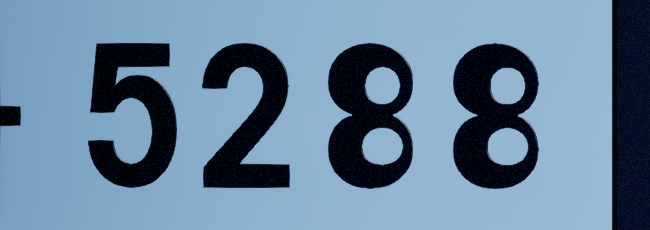
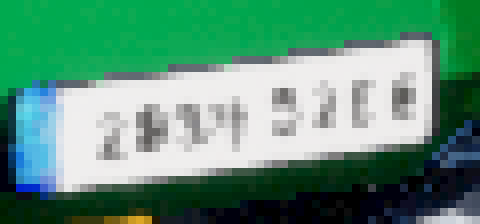

# 번호판 양각 — 노멀맵(머티리얼 릴리프) 전환 제안

작성 2026-08-27 16:13 / 선행 [양각 구현](20260826_192515_번호판_양각_구현.md) · [방안 제시](20260826_165658_번호판_양각_구현방안.md)

> 이 문서는 **진단 + 제안**이다. 코드는 아직 고치지 않았다. 결정이 필요한 항목은 7장에 있다.
> 실행 중인 `Package/Windows` 인스턴스(sim1, RPC 13510)에서 카메라 1·2 로 촬영해 실측했고,
> **카메라 2 의 위치·PTZ 는 촬영 후 원래 값으로 되돌렸다**(`pos (21.917, 4.113, 4.5)`, `pan 120.4 / tilt 9.78 / zoom 1.68`).

---

## 1. 요약

사용자가 말한 두 증상은 **원인이 서로 다르고, 둘 다 재현·계량됐다.**

| 증상 | 실측 원인 | 지금 방식으로 고칠 수 있나 |
|------|----------|--------------------------|
| ① 멀리서만 양각처럼 보인다 (가까이서 평평하다) | 측벽이 화면에 **2.5px 나 있는데도 명암 대비가 0** — 압출이 얇아서가 아니라 **글자 머티리얼이 빛을 못 받아서**다 | 예 (머티리얼만 고치면 됨) |
| ② 글씨 오른쪽이 얇아 깨진다 | 원거리에서 **획 굵기 0.7px** — 지오메트리는 밉맵이 없어 서브픽셀에서 그냥 사라진다 | **아니오 — 지오메트리로는 원리상 불가** |

②는 압출 두께·폰트·베벨을 어떻게 바꿔도 안 고쳐진다. 3D 글자에는 LOD/밉이 없어서
한 픽셀보다 얇아지면 표본이 걸리는 프레임에만 찍힌다. **텍스처(밉·이방성 필터)로 옮겨야 풀린다.**

그래서 제안은 사용자의 지시(노멀맵)와 같은 방향이다 — **릴리프를 지오메트리에서 머티리얼로 옮긴다.**
번호를 SDF(거리장) 마스크 텍스처로 만들어 판 머티리얼이 색·노멀·거칠기를 함께 그린다.

---

## 2. 진단 — 실측

### 2.1 증상 ① : 측벽은 있는데 명암이 없다

근접 촬영(카메라 2, 지면 `(23.2, 0)` 높이 0.62m, `pan 145.6 / tilt 0.30 / zoom 36`).
화면 축척 **0.40 mm/px** (글자 높이 5.98cm ≈ 150px). 압출 실효 1.0mm → **측벽이 2.5px** 나와야 한다.



글자 획을 가로지르는 픽셀 스캔(RGB 합, 4px 간격):

```
y=270  489 489 491 489 |   0  13  26  13  13  35 | 495 497 500 501 500 ...
y=330  495 493 495 493 497 497 500 497 ... 506 | 121  13  13   0   0  13 | 136 513 514 ...
```

판(≈495) → 글자(≈13) 로 **한 표본 만에 떨어진다.** 중간값 `121`·`136` 은 AA 한 픽셀이고,
**어느 쪽에도 판보다 밝은 값이 없다.** 실제 1mm 모따기가 태양을 받으면 한쪽에 판보다 밝은 스페큘러
띠가, 반대쪽에 판보다 어두운 접지 그림자가 생겨야 한다. **양쪽 다 0 이다.**

원인은 두께가 아니라 글자 머티리얼이다.

- 알베도가 `(0.015, 0.015, 0.015)` 다 (`CarActor.cpp:211`). 디퓨즈 = 알베도 × 조도이므로
  **법선이 어떻게 놓이든 결과가 0.015 배로 깎여 명암 차이가 사라진다.** 릴리프는 명암으로만 보이는데
  그 명암을 실을 자리가 없다.
- 베이스가 `/Engine/BasicShapes/BasicShapeMaterial` 이라 러프니스가 균일하다 →
  앞면·모따기·측벽이 **같은 스페큘러 응답**을 낸다. 형태 차이가 하이라이트로 안 갈린다.
- 베벨 0.02cm(0.2mm)·2세그먼트 → 0.5px. 하이라이트가 실릴 면적 자체가 없다.
- `SetCastShadow(false)` (`CarActor.cpp:217`) 라 접지 그림자도 없다.

부수 관측: **줌 36 에서 흰 판이 화면을 채우면 자동 노출이 내려가 장면 전체가 어두워진다.**
(같은 시각 zoom 8 은 한낮, zoom 36 은 야간처럼 나온다.) 근접 A/B 는 노출이 오염되므로
같은 줌·같은 프레임에서 비교해야 한다.

### 2.2 증상 ② : 원거리 획 굵기 0.7px

카메라 1 기본 화각(zoom 1.72)에서 촬영. 판 폭 52.1cm 가 **47px** → **11.1 mm/px**.
번호판 획 굵기는 약 7~8mm → **0.7px**.



같은 줄의 픽셀값(RGB 합, 판 흰색 = 714):

```
y=583  ... 714 633 661 631 606 686 | 414 300 489 459 | 684 700 477 412 ... 706 697 705 709 595
                                     ↑ 왼쪽 글자는 그나마 남는다        ↑ 오른쪽은 전부 700+ = 판 흰색
```

- 글자가 검정(13)에 못 가고 **95/255 회색까지만** 간다 — 픽셀 안에서 판과 섞였다.
- 판의 **오른쪽 절반은 값이 전부 700 대**다. 글자가 통째로 사라졌다.
- 오른쪽만 유독 심한 이유: 차가 비스듬해서 판의 오른쪽이 더 멀고 더 단축(foreshortening)돼
  화면 축척이 왼쪽보다 크다. 사용자가 "오른쪽이 얇아 깨진다"고 본 그대로다.

**지오메트리에는 밉맵이 없다.** 삼각형이 픽셀보다 얇아지면 래스터라이저가 그 픽셀 중심을 안 덮어
아예 안 그려지고, TAA/TSR 은 없는 표본을 복원하지 못한다. 반면 텍스처는 밉·이방성 필터가
"평균 회색"으로 우아하게 수렴한다 — 실제 CCTV 영상에서 멀리 있는 번호판이 보이는 모습이 그쪽이다.

---

## 3. 제안 — 릴리프를 머티리얼로 옮긴다

### 3.1 구조

```
[오프라인 1회]  Pretendard Bold TTF
      │  글리프별 초고해상 래스터 → 정확한 유클리드 SDF
      ▼
  T_PlateGlyphSDF  (아틀라스 1장, 예: 2048×1024, 글리프 50자 × 128²)
  plate_glyph_metrics.json  (셀 좌표 · advance · bearing)

[로딩 1회 / 차량]  번호 8글자를 512×128 R8 렌더타깃에 8개 쿼드로 합성 (auto-mips)
      ▼
  MID(M_PlateFront) 의 텍스처 파라미터로 대입

[매 프레임]  M_PlateFront 안에서
  d  = SDF 샘플
  색   BaseColor = lerp(판 흰색/파란 KOR, 글자 검정, 1-smoothstep(fwidth 폭))   ← 어떤 거리에서도 깨끗
  높이 h        = 모따기 프로파일(d)                                            ← 1.5mm 양각
  노멀 N        = ∇d 로 만든 접선공간 노멀 ⊕ 기존 T_Normal(판 표면 결)
  거칠기        = lerp(판 러프, 글자 도료 러프)
  (선택) Bump Offset 으로 사각 시야 패럴랙스
```

### 3.2 왜 이게 두 증상을 다 고치나

- **①** — 판 머티리얼이 노멀·거칠기를 함께 내므로 모따기 폭을 **원하는 만큼**(예: 0.5mm) 줄 수 있고,
  그 폭이 픽셀 수에 안 묶인다. 알베도는 검정으로 두되 **릴리프는 스페큘러·노멀이 만든다** —
  실제 번호판도 검은 도료의 광택 띠로 읽히지 알베도 차이로 읽히지 않는다.
- **②** — SDF 는 밉을 타도 "거리"가 평균될 뿐 형태가 안 부서진다. 확대해도 벡터처럼 날카롭고,
  축소하면 회색으로 수렴한다. **0.7px 상황에서 사라지는 대신 흐려진다.**

### 3.3 SDF 를 쓰는 이유 (커버리지 마스크 대비)

| | 커버리지(알파) 마스크 | SDF |
|---|---|---|
| 확대 | 텍셀이 뭉개짐 | 벡터처럼 날카로움 (`fwidth` AA) |
| 축소 | 밉으로 회색 수렴 (OK) | 동일 (OK) |
| 모따기 | 별도 블러 필요, 폭 고정 | **`smoothstep(d)` 로 공짜**, 폭 자유 |
| 노멀 | 유한차분 4탭 | **∇SDF = 모따기 방향** (1~4탭, 정확) |
| 용량 | 차량마다 큰 텍스처 | 글리프 아틀라스 1장 공유 |

모따기와 노멀을 공짜로 얻는 것이 핵심이다.

### 3.4 지오메트리(Text3D)는 어떻게 하나

**제거를 권한다.** 근거:

- 1.5mm 실루엣은 1m 밖에서 이미 서브픽셀이다 — 남겨도 보이는 건 ②의 깨짐뿐이다.
- 제거하면 [양각 구현 문서](20260826_192515_번호판_양각_구현.md) 4.1 의 **GeometryMask 글로벌 셰이더
  함정이 사라진다**(플러그인 제거 시). exe 교체 검증이 다시 가능해진다.
- 드로우콜·메모리·로딩 시간이 같이 준다 (5장).
- 4.2 의 21GB 메모리 사고, 4.4 의 0.1cm 양자화(규격 1.3~1.6mm 를 못 맞추는 문제)도 함께 없어진다 —
  머티리얼 높이는 연속값이라 **1.5mm 를 정확히 준다.**

다만 **극단적 사각(판을 거의 옆에서 볼 때)** 에서는 실루엣이 없어 평평해 보인다.
그 구간은 Bump Offset(1탭) 또는 POM(8~16탭)으로 메운다. CCTV 화각에서 그 각도가 실제로 나오는지는
확인이 필요하다 — 안 나오면 Bump Offset 도 뺀다.

---

## 4. 단계 제안 (품질↑ / 시간↓ — 3번 질문에 대한 답)

시간을 아끼는 핵심은 **"차량마다 만들지 말고, 글자마다 한 번 만들어 공유하라"** 다.
번호판에 쓰이는 글자는 숫자 10자 + 한글 40자 안쪽으로 **닫힌 집합**이다.

| 단계 | 하는 일 | 얻는 것 | 드는 시간 |
|------|--------|--------|----------|
| **S1** 즉효 | 글자 머티리얼만 교체(러프니스·스페큘러 부여), 베벨 0.2→0.5mm·4세그, 컨택트 섀도 켜기 | 증상 ① 상당 부분 해소 | 코드 반나절 + 재쿡 |
| **S2** 본 수정 | SDF 아틀라스 + 판 머티리얼 릴리프, Text3D 제거 | ①② 모두 해소, 비용 **감소** | 2~3일 + 재쿡 |
| **S3** 오프로드 | 아틀라스 베이크를 3090 서버로 (6장) | 품질 상향(정확 SDF·AO·실측 모따기), 로컬 시간 0 | 1일 |

**S2 없이 S1 만으로는 ②가 남는다.** S1 은 S2 로 가는 중간 단계로도 쓸 수 있지만(머티리얼 지식 재사용),
S2 를 바로 하기로 하면 S1 은 건너뛰어도 된다.

### 시간을 아끼는 구체적 수단

1. **글리프 단위 베이크 → 런타임 합성.** 차량 23대 × 8글자 = 184 글자지만 고유 글자는 15~20자다.
   차량마다 텍스처를 굽지 않고 아틀라스에서 8쿼드만 붙인다 → 차량당 **1 드로우콜**.
2. **런타임 SDF 계산 금지.** 유클리드 거리변환은 1024×256 에서 수 ms 다. 오프라인으로 민다(S3).
3. **번호판 텍스처는 512×128 R8 = 64KB.** 23대 = 1.5MB. 밉 포함 2MB.
   지금 Text3D 글리프 메시(차량당 앞뒤 16글자 × 압출+베벨 메시)보다 훨씬 싸다.
4. **아예 렌더타깃도 안 만드는 길**(더 빠름): 번호 8글자의 아틀라스 셀 인덱스를
   **per-instance custom data** 로 넘겨 셰이더가 UV 로 셀을 고른다 → 차량당 텍스처 0장, 샘플 1회.
   대가는 글자 폭(advance)이 가변이라 셀 폭 테이블이 셰이더에 들어가는 것. **S2 가 돌고 난 뒤 검토를 권한다.**
5. **모따기 폭을 거리에 따라 넓힌다.** `fwidth(d)` 로 화면 축척을 알 수 있으므로, 멀어질수록
   모따기를 두껍게 해 릴리프가 밉에 먹히지 않게 한다. 지오메트리로는 불가능한 최적화다.

---

## 5. 실시간 비용 (2번 제약에 대한 답)

| 항목 | 지금 (Text3D) | 제안 (머티리얼) |
|------|--------------|----------------|
| 로딩 | 23대 12초 (언쿡 기준, 압출 빌드) | 아틀라스 로드 1회 + 차량당 8쿼드 블릿 ≈ **수 ms** |
| 드로우콜 | 판당 글자 메시 다수 × 46판 | 판 메시에 흡수 → **+0** |
| 픽셀 비용 | 낮음 | 텍스처 1~4탭 + 노멀 블렌드 ≈ **20 instr 내외** |
| 메모리 | 글리프 메시 + 캐시 | 아틀라스 ~2MB + 판 텍스처 ~2MB |
| 셰이더 | GeometryMask 글로벌 셰이더 의존 | 없음 |

**총량은 준다.** 픽셀 비용이 조금 늘지만 번호판이 화면에서 차지하는 면적이 작아 무시할 수준이고,
드로우콜·로딩·메모리가 크게 줄어든다. 실측은 구현 후 `stat unit`·`stat rhi` 로 확인한다.

---

## 6. 3090 우분투 서버(192.168.0.210) 활용 (4번 질문에 대한 답)

### 6.1 지금 서버 상태 (실측)

```
ping    5~14ms
:22     열림 (SSH) — 단 우리 쪽에 호스트키·계정 정보가 없다 (Host key verification failed)
:80     열림 — nginx 기본 페이지 (미설정)
:11434  열림 — Ollama 0.30.10
```

`~/.ssh/config` 에는 **다른** 3090 박스(`go100-ai3090x2` = 192.168.0.4, user `agent01`)만 있다.
**210 에 붙으려면 계정/키가 필요하다.**

### 6.2 무엇을 보낼 것인가 — 세 가지 안

> 전제: **실시간 프레임을 원격에 맡길 수는 없다.** 왕복이 ms 단위여도 프레임 예산 밖이다.
> 서버가 맡을 수 있는 건 **오프라인 베이크**다. 그래서 "완료되면 오브젝트를 받는다"는 요구는
> **에셋(텍스처/메시)을 받아 프로젝트에 반입하는 파이프라인**으로 푼다.

| 안 | 서버가 하는 일 | 받는 것 | 평가 |
|----|--------------|--------|------|
| **A. SDF 아틀라스 베이크** | freetype 으로 글리프를 4096² 래스터 → CUDA jump-flood 로 정확 SDF → 128² 로 축소 | `T_PlateGlyphSDF.png` + `metrics.json` (수 MB) | **권장.** S2 가 바로 쓴다. 구현 반나절 |
| **B. Blender 하이폴 → 노멀/AO 베이크** | 진짜 모따기·도료 엣지가 있는 하이폴 판을 만들고 Cycles(GPU)로 탄젠트 노멀 + AO + 하이트 베이크 | `T_PlateEmbossNRM.png`, `_AO.png`, `_H.png` | 품질 최상. **글자 뿌리의 AO 가 양각을 결정적으로 살린다.** A 위에 얹는 옵션 |
| **C. 번호판 메시 자체를 받기** | 번호별로 압출 메시를 만들어 `.glb` 로 내보냄 | `.glb` (번호마다 1개) | 사용자가 말한 그대로지만 **증상 ②를 못 고친다**(여전히 지오메트리). 권하지 않음 |

**A + B 조합을 권한다.** A 로 형태(어떤 거리에서도 안 깨지는 글자)를, B 로 질감(모따기 광택·뿌리 AO)을 얻는다.

### 6.3 받는 방법 (구현안)

**보안은 넣지 않는다** — 이 프로젝트 정책(`park3d-no-security`). 사내 LAN 전용.

서버측 `plate_bake` 서비스 (FastAPI + uvicorn, nginx 뒤 또는 :8090 직접):

```
POST /bake            {"glyphs":["0".."9","가",...], "px":128, "bevel_mm":0.5, "mode":"sdf|blender"}
   → 202 {"job_id":"..."}
GET  /bake/{job_id}          → {"state":"running|done|error", "progress":0.42, "log":"..."}
GET  /bake/{job_id}/result   → application/zip  (atlas.png, metrics.json, [nrm.png, ao.png])
```

클라이언트측 `Tools/plate_bake/request_bake.py` (Windows):

1. `POST /bake` → job_id
2. 폴링 → done
3. zip 다운로드 → `Park3D/Content/Actors/Car/Plates/Textures/` 에 PNG,
   `Park3D/Save/Config/plate_glyph_metrics.json` 에 메트릭
4. UE 반입: 에디터가 켜져 있으면 Unreal MCP 로 `import_asset`,
   꺼져 있으면 `UnrealEditor-Cmd.exe <uproject> -run=ImportAssets` 커맨드릿

**메트릭 JSON 은 반드시 git 에 추적한다.** `Content/` 는 `.gitignore` 라
텍스처만 받아 두면 다른 PC 에서 재생성이 안 된다 — `car_catalog.json` 폴백 때와 같은 함정
(2026-08-16 이력).

### 6.4 대안 — 서버 없이 로컬로도 된다

정직하게 적는다. **A 안은 로컬 파이썬으로도 몇 초면 끝난다**(글리프 50자, scipy EDT).
서버가 꼭 필요한 것은 **B(Blender Cycles GPU 베이크)** 뿐이고, 그것도 1회성이라
로컬 GPU 로 몇 분이면 된다. 즉 **3090 은 "있으면 좋은 것"이지 병목이 아니다.**

서버를 쓸 실익이 확실한 경우는 이런 쪽이다:

- 글리프를 50자가 아니라 **한글 전체(11,172자)** 로 굽는 경우
- 차종·조명 조합을 바꿔 가며 **대량으로 A/B 렌더**를 돌려 임계값을 잡는 경우 (`scenario.*` 확장)
- 텍스처 초해상(ESRGAN 류)·노멀 추정 모델을 태우는 경우

**4번은 "가능하고, 방법은 6.3 이다. 다만 이번 작업에는 필수가 아니다"** 가 정확한 답이다.

---

## 7. 결정이 필요한 것

1. **지오메트리를 걷어낼까?** (권장: 걷어낸다 / 유지하고 머티리얼만 보강 / 둘 다)
   - 걷어내면 `Text3D` 플러그인도 뺄지 → 빼면 4.1 함정이 사라지나 **전체 재쿡이 한 번 더** 필요
2. **S1(즉효)을 먼저 넣고 볼까, S2 로 바로 갈까?**
3. **192.168.0.210 계정/키** — 없으면 6.4 대로 로컬 베이크로 진행한다
4. **재쿡을 지금 해도 되나?** 지금 `Package/Windows` 인스턴스 2개가 떠 있고
   (`Park3D.exe` PID 6712 / 15160, 10:55 기동) 전체 재쿡은 이것을 닫아야 한다(58분)
   - 닫으면 안 되면 검증은 `UnrealEditor.exe <uproject> -game` 경로로만 한다

---

## 8. 이번에 확인한 사실 (다음 세션용)

- **`cam.setPosition` 의 `pos` 는 `{x, y, z}` 이고 `x·y` 가 지면, `z` 가 높이다.**
  선행 문서(7장)의 "`{x, z}` 가 지면 + 높이는 `cam.setHeight`" 는 **틀렸다** —
  `{x, z}` 만 주면 `y` 가 0 으로 밀리고 `z` 가 높이로 들어간다. 실증: 복원하려다 카메라가
  `(21.917, 0, 4.113)` 으로 갔고, `{x, y, z}` 를 다 주니 `(21.917, 4.113, 4.5)` 로 정확히 돌아왔다.
  `cam.list` 의 표기와 같은 규약이다.
- **줌 36 근접에서는 흰 판이 자동 노출을 지배해 장면이 야간처럼 어두워진다.** 조명·릴리프 A/B 는
  같은 줌에서 해야 한다.
- 실행 중인 `Package/Windows` 는 **양각이 들어간 빌드다**(로그 `[CarPlate] 양각 ... front(생성=1 크기=X=0.100 ...)`).
  선행 문서 6장의 "패키지 검증 미실시"는 그 뒤 재쿡으로 해소된 상태다.
- `SM_Plate_F`/`_B` 의 머티리얼 슬롯은 `M_PlateFront`(0) + `M_PlateFrame`(1) 이다.
  `M_PlateFront` 는 이미 `T_Normal` 을 물고 `MDR_ColorNormalRoughness` 로 나가며, 파란 KOR 스트립을
  `TextureCoordinate` + `Lerp` 로 절차 생성한다 → **UV 가 판 면에 의미 있게 깔려 있다**(제안 3.1의 전제).
  정확한 UV 구간은 에디터에서 확인해야 한다.
