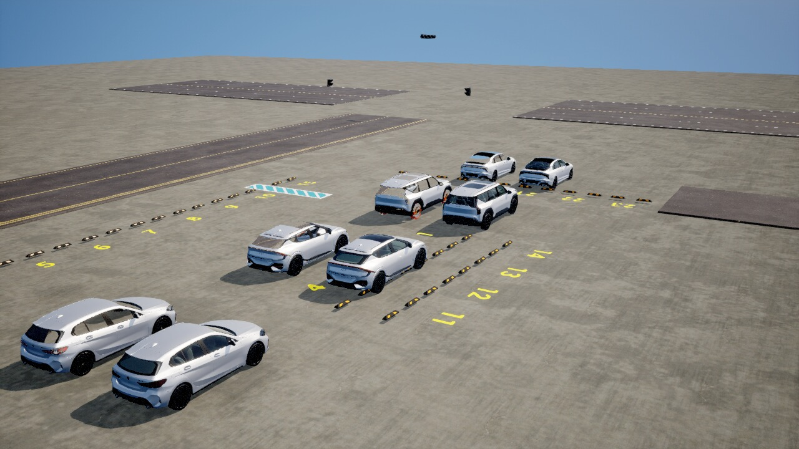
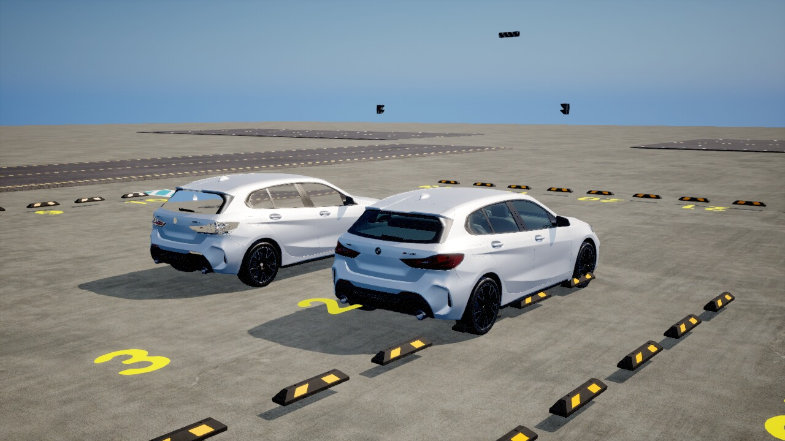
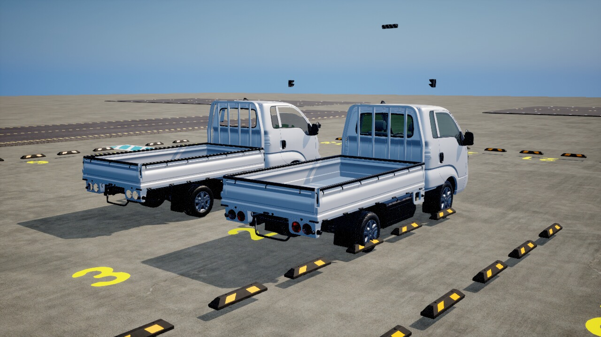
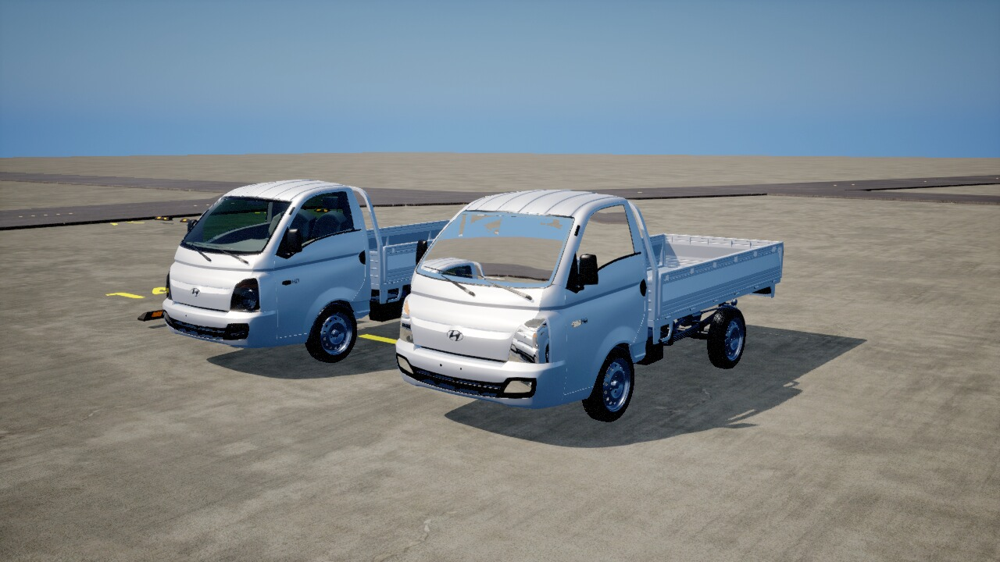

# Omniverse 차량 USD → 언리얼 재임포트(원본 유지) + OmiPark3D 전용 RPC 51종 이식

작성: 2026-09-21 · 브랜치 `feat/omni-ext-rpc-usd-import` (main 68d1922 에서 분기) · 저장소 `D:\Work2\Unreal2\UPark3D`

## 0. 요청과 해석

사용자 요청(OmniversPark3D 세션에서):

1. 차량 오브젝트를 각각 언리얼 포맷으로 변환
2. UPark3D `Content` 의 차량 오브젝트를 제거하고 변환본을 넣기
3. UPark3D 에 없는 RPC 를 언리얼에 추가
4. 빌드 후 동작 확인 (+ 변환 후 스크린샷)

조사 결과 Omniverse 쪽 차량 23종(`OmiPark3D/contents/Cars/<slug>/`)은 **바로 이 저장소의
`Content/Actors/Car/Meshs/*.uasset` 을 UE 5.8 커맨드릿(`Tools/usd_export/`)으로 내보낸 사본**이다(보드 #491).
그대로 되돌려 원본을 지우면 6단 LOD 원본 재질(M_Transmission 계열 유리 등)을 512px 베이킹 텍스처로 덮는
열화이고, `Content/` 는 git·SVN 어디에도 없어 복구 불가다. 그래서 사용자에게 물어 아래로 확정했다.

| 항목 | 결정 |
|---|---|
| 1·2 | **별도 폴더 `/Game/Actors/Car/Meshs_USD/<slug>/` 로 임포트, 원본 `Meshs/` 는 그대로**. 원본/임포트본을 나란히 찍어 비교 |
| 3 | 언리얼에 없는 확장 method **전부**(51개 — OmiPark3D 가 `unreal=False` 로 표시한 것) |
| 4 | 게임/에디터 타깃 빌드 → Automation 테스트 → 별도 exe(Work13520)로 실 RPC 왕복 |

## 1. 차량 USD 재임포트 — `Tools/usd_import/`

### 1.1 파일

| 파일 | 역할 |
|---|---|
| `run_import.py` | 호스트. `car_catalog.json` 순서로 job JSON(ensure_ascii) → UE 임포트 wrapper(`<slug>_ue.usda`) 작성 → `UnrealEditor-Cmd -run=pythonscript` 기동 → `_report.json`·`.uasset` 실물로 판정 → `_summary.json`. `--per-car`, `--compare`, `--shoot` |
| `import_cars.py` | 커맨드릿 안. `UsdStageImportOptions` 로 StaticMesh 임포트 → 슬롯 이름 복원 → LOD 구획 재매핑 → 저장 |
| `make_compare_level.py` | 커맨드릿 안. `/Game/Maps/LV_CarCompare` 에 원본(x=0)·임포트본(x=+3.5 m) 쌍을 y 방향 9 m 간격으로 배치 |
| `shoot_compare.py` | **에디터 본체**(`UnrealEditor.exe -ExecCmds="py …"`) 안. 슬레이트 틱으로 쌍마다 뷰포트 카메라를 옮겨 `HighResShot 1920x1080` |

### 1.2 입력 — UE 임포트용 wrapper

Omniverse wrapper(`<slug>_omniverse.usda`)는 `metersPerUnit=1` + `xformOp:scale 0.01` 이고, LOD0 밑에 유리
보정(glass_fix: 색·IOR·opacity, `smokedglass` 서브셋)과 상수 노멀 `(0.498,-0.498,1)` → `(0,0,1)` 평탄화가
`over` 로 얹혀 있다. 이것을 그대로 UE 에 넣으면 단위가 100배가 되므로, 그 wrapper 를 **참조하면서 단위만
되돌리는** 한 겹을 더 쓴다(원본·Omniverse wrapper 무수정):

```
#usda 1.0
( defaultPrim = "<slug>"  metersPerUnit = 0.01  upAxis = "Z" )
def Xform "<slug>" ( prepend references = @./<slug>_omniverse.usda@ )
{
    double3 xformOp:scale = (1, 1, 1)          # 참조된 0.01 을 덮는다
    uniform token[] xformOpOrder = ["xformOp:scale"]
}
```

### 1.3 임포트 옵션과 후처리

| 옵션 | 값 | 이유 |
|---|---|---|
| `import_actors` | False | 에셋만. 액터는 비교 레벨 스크립트가 따로 놓는다 |
| `interpret_lods` | True | 내보내기가 만든 `variantSet "LOD"`(LOD0~5) 를 StaticMesh LOD 로 되돌린다 |
| `nanite_triangle_threshold` | INT32 최대 | 원본이 LOD 메시라 Nanite 로 바꾸지 않는다 |
| `existing_asset_policy` | REPLACE | 재실행 시 덮어쓰기 |
| `merge_identical_material_slots` | False | carpaint 등 구획 구분을 살린다 |

후처리(`import_cars.py`) — 셋 다 실측으로 필요했던 것:

1. **슬롯 이름 복원**: USD 의 재질 prim 이 전부 `UnrealMaterial` 이라 임포트 결과가 `MI_UnrealMaterial_N`, 슬롯
   이름도 `0,1,2…` 가 된다. 내보내기 요약 `contents/Cars/_summary.json` 의 `ue_mesh.materials` 순서로 슬롯 이름을
   `rim, tire, …, carpaint, …` 로 되돌리고 재질 에셋도 `MI_<이름>` 으로 개명한다. `UCarColorComponent` 가
   `carpaint` 슬롯 이름으로 도색 슬롯을 찾기 때문. 매핑 검증: `MI_redglass` BaseColor=(0.988,0.096,0.058),
   `MI_orangeglass`=(0.787,0.241,0), `MI_clearglass` opacity 0.3 — wrapper 값과 일치.
2. **LOD1~5 구획 재매핑**: `interpret_lods` 가 LOD 마다 구획 13개를 재질 없는 새 슬롯(14~78, 65개)으로 넣는다.
   `StaticMeshEditorSubsystem.set_lod_material_slot` 로 구획 s → 슬롯 s 로 되돌리고 빈 슬롯을 지운다(포터: 79 → 14).
   (내보내기 문서가 지적한 "낮은 LOD 의 구획 면 번호 어긋남"은 USD 안에 이미 박힌 것이라 여기서 못 고친다.)
3. glass_fix 가 더한 추가 슬롯(`MI_Glass_Smoke`)은 슬롯 이름 `Glass_Smoke` 로 둔다.

### 1.4 실측·함정

| 함정 | 내용 |
|---|---|
| 커맨드릿 작업 폴더 | 스크립트 폴더와 다르다 → job/out 경로는 전부 절대 경로 |
| 목적지 이중 폴더 | 임포터가 `<dest>/<스테이지 이름>/StaticMeshes|Materials|Textures` 를 스스로 만든다. `<dest>/<slug>` 를 주면 `<slug>/<slug>/…` |
| `StaticMaterial.imported_material_slot_name` | 파이썬 바인딩에 없다. `material_slot_name` 만 |
| `StaticMeshEditorSubsystem` | 커맨드릿에서 `get_editor_subsystem` 이 None → `unreal.load_module("StaticMeshEditor")` 뒤 다시 찾으면 된다. `get_lod_section_count` 는 없고 `StaticMesh.get_num_sections(lod)` + `get_lod_material_slot` |
| **한 프로세스 여러 대 = OOM** | 8대째(kia_bongo)에서 가상 메모리 124 GB → `Ran out of memory` + `Out of video memory` 크래시. 메시 빌드(Embree 거리장 등)가 대마다 쌓인다. → `--per-car`(대당 프로세스) 로 확실히 끝난다. 대당 에디터 기동 20초 |
| Bash 툴 10분 제한 | 백그라운드 커맨드도 10분에 끊긴다 → `Start-Process` 로 분리 |
| 도색 파라미터 이름 | 임포트 재질은 USD `UsdPreviewSurface` 부모(파라미터 `BaseColor`)이고 프로젝트 차량 도색은 glTF 재질의 `BaseColorFactor` 다. **`car.setColor` 는 임포트본을 못 칠한다**(슬롯은 찾지만 파라미터가 없다). `BP_Car` 가 쓰는 것은 여전히 원본이므로 운영 영향 없음 |
| 게임 인스턴스 동시 실행 | 커맨드릿(커밋 76 GB)과 겹치면 게임이 `Out of video memory` 로 죽는다(Work13520 재기동 실패 1회). 임포트 끝나고 띄울 것 |

### 1.5 결과

23/23 임포트 성공 · `.uasset` 합계 1,603 MB(원본 `Meshs/` 750 MB의 약 2.1배 — 베이킹 텍스처·재질 인스턴스 포함, 대당 32~116 MB) · 전 차종 LOD 6단 · 크기(cm)는 원본 UE 메시와 동일 축(길이 = Y).

| id | 차종 | slug | uasset MB | LOD | LOD0 삼각형 | 크기 cm (x,y,z) | 슬롯 | 초 |
|---|---|---|---|---|---|---|---|---|
| 1 | BMW_1시리즈 | bmw_1series | 66.6 | 6 | 1,533,698 | 208, 439, 147 | 17 | 92 |
| 2 | 기아_EV6 | kia_ev6 | 74.9 | 6 | 1,772,898 | 205, 464, 155 | 14 | 97 |
| 3 | 기아_EV9 | kia_ev9 | 67.6 | 6 | 1,770,926 | 228, 501, 178 | 19 | 142 |
| 4 | 기아_K5 | kia_k5 | 78.1 | 6 | 2,003,084 | 215, 489, 149 | 20 | 112 |
| 5 | 기아_레이 | kia_ray | 79.5 | 6 | 1,592,740 | 205, 378, 185 | 14 | 119 |
| 6 | 기아_모닝 | kia_morning | 59.4 | 6 | 1,399,076 | 183, 362, 163 | 15 | 237 |
| 7 | 기아_봉고 | kia_bongo | 116.2 | 6 | 3,157,248 | 208, 521, 211 | 14 | 108 |
| 8 | 기아_봉고_탑차 | kia_bongo_boxtruck | 101.8 | 6 | 2,596,724 | 208, 521, 251 | 19 | 156 |
| 9 | 기아_쏘울 | kia_soul | 58.3 | 6 | 1,527,107 | 196, 410, 157 | 17 | 89 |
| 10 | 기아_쏘렌토 | kia_sorento | 82.9 | 6 | 2,039,301 | 211, 472, 169 | 21 | 140 |
| 11 | 기아_카니발 | kia_carnival | 70.5 | 6 | 1,860,808 | 236, 526, 184 | 17 | 108 |
| 12 | 르노삼성_SM7 | renaultsamsung_sm7 | 70.3 | 6 | 1,345,843 | 224, 512, 154 | 14 | 80 |
| 13 | 볼보_V60 | volvo_v60 | 67.9 | 6 | 1,723,366 | 208, 475, 142 | 18 | 89 |
| 14 | 제네시스_G90 | genesis_g90 | 55.0 | 6 | 1,371,856 | 210, 502, 141 | 14 | 76 |
| 15 | 포드_머스탱 | ford_mustang | 73.1 | 6 | 1,917,391 | 204, 466, 133 | 16 | 94 |
| 16 | 폭스바겐_폴로 | volkswagen_polo | 56.2 | 6 | 1,416,273 | 201, 410, 159 | 16 | 81 |
| 17 | 현대_스타렉스 | hyundai_starex | 61.9 | 6 | 1,305,246 | 227, 518, 196 | 14 | 89 |
| 18 | 현대_싼타페 | hyundai_santafe | 92.2 | 6 | 2,301,664 | 238, 482, 177 | 12 | 98 |
| 19 | 현대_쏘나타 | hyundai_sonata | 47.8 | 6 | 1,221,216 | 212, 492, 146 | 16 | 74 |
| 20 | 현대_아이오닉9 | hyundai_ioniq9 | 77.5 | 6 | 2,111,928 | 230, 510, 181 | 17 | 118 |
| 21 | 현대_캐스퍼 | hyundai_casper | 54.3 | 6 | 1,330,324 | 187, 364, 163 | 14 | 67 |
| 22 | 현대_포터 | hyundai_porter | 32.1 | 6 | 732,644 | 192, 502, 197 | 14 | 42 |
| 23 | 혼다_ZR-V | honda_zrv | 59.0 | 6 | 1,368,378 | 214, 454, 164 | 17 | 86 |

실행 이력: 1차 한 프로세스 23대 → Bash 툴 10분 제한으로 3대에서 중단 · 2차 분리 프로세스 → 8대째 OOM 크래시(3대 완료) · 3차 `--per-car` 17대 전부 성공(대당 42~237초, 에디터 기동 포함). 리포트: `Park3D/Saved/USDImport/{Cars,Cars_b2,Cars_b3}/_report.json` → `_merged_report.json`.

스크린샷(원본 왼쪽 x=0 · 임포트본 오른쪽 x=+3.5 m, `LV_CarCompare`):

촬영은 `Tools/usd_import/shoot_rpc.py` — `UnrealEditor.exe Park3D.uproject -game -RpcPort=13530 -EnablePlugins=USDImporter` 인스턴스에
`env.create`(원본·임포트본 오브젝트 경로 직접 지정) → `cam.setPosition`/`cam.setPTZ` → `cam.captureJPG` 로 47장(정면 3/4·후면 3/4 × 23 + 조감).
**front34·조감: 왼쪽 = 임포트본(Meshs_USD), 오른쪽 = 원본(Meshs). rear34 는 반대.** 전체는 `Park3D/Saved/USDImport/Cars/shots_rpc/`,
대표 26장은 `Docs/shots/20260921_usd_import/`.

| | |
|---|---|
|  |  |
|  |  |

육안 비교(23쌍): 형상·치수·휠·도색은 원본과 구분이 어렵고, 차이는 **유리** — 임포트본은 UsdPreviewSurface 반투명(opacity 0.3~0.85 상수)이라
창이 더 투명하고 램프 커버가 밝은 회백색으로 보인다(원본은 M_Transmission 계열 틴트 유리). 이는 내보내기 베이킹의 한계(보드 #491 항목 4)를
wrapper 의 glass_fix 값으로 메운 결과이지 임포트 오류가 아니다.

**에디터 뷰포트 경로가 전부 실패한 기록**(다음 사람이 반복하지 않게): ① 커맨드릿 `EditorLevelLibrary/EditorActorSubsystem.spawn_actor_*` → `No actor was spawned`
② `-unattended` 에디터 `LevelEditorSubsystem.new_level` → `Failed to save the new level` ③ `HighResShot` → 47장 전부 검정(뷰포트가 그리지 않음)
④ `SceneCapture2D` + `RenderingLibrary.export_render_target` → 검은 노이즈(BaseColor·Depth 도 빈 화면) ⑤ 슬레이트 틱 콜백은 메시 로딩 중 재진입한다
(`new_blank_map` 이중 호출 → World Memory Leaks fatal). 게임 런타임의 `cam.captureJPG` 는 스트림과 같은 렌더타깃이라 확실했다.
⑥ **`-game` 인스턴스에 `-EnablePlugins=USDImporter` 가 없으면 임포트 재질의 부모 `/USDCore/Materials/UsdPreviewSurface*` 가 마운트되지 않아
회색 기본 재질로 나온다**(로그 `LoadErrors: … a dependent package /USDCore/… was not available`). 패키지 빌드에서 임포트본을 쓰려면 `.uproject` 에
USDImporter 를 켜 `/USDCore` 를 쿠킹하거나 재질을 프로젝트 재질로 재부모화해야 한다(이번 범위 밖).

## 2. 확장 RPC 51종 이식 — `Source/Park3D/Rpc/`

OmiPark3D 의 `system.describe` 가 `unreal=False` 로 드러내던 51개(bay 13 · env 11 · cam 12 · car 5 · plate 3 ·
file 2 · scene 2 · preset.importFile · system.describe/stats). 파이썬 구현(`OmiPark3D/src/omipark3d/rpc/modules/*.py`)을
정본으로 이름·파라미터·결과 키를 맞췄고, 언리얼에 대응물이 없는 부분만 아래 "차이" 에 적었다.

### 2.1 파일

| 파일 | 변경 |
|---|---|
| `Rpc/Modules/BayRpcModule.{h,cpp}` (신규) · `Env/BayPropActor.{h,cpp}` (신규) | `FBayRpcModule` 13 method. 주차면 = (a) 레벨 `BP_ParkingSlot*` 의 `ISM_Slot` 인스턴스(읽기 전용, 키 `level:<액터>#<인스턴스>` = `preset.numbers` 와 동일) 또는 (b) `bay.create/load/fromPresets` 가 스폰하는 `ABayPropActor`(엔진 Plane, 레벨 `ISM_Slot` 재질 차용, 태그 `BayProp`) |
| `Rpc/Modules/EnvRpcModule.{h,cpp}` · `Env/EnvActorLibrary.{h,cpp}` | env 11 method 추가(`env.list/hide` 무수정). `Park3DEnv::SetActorHidden`, `IsMapKeepActor` 추가 |
| `Rpc/Modules/SceneRpcModule.{h,cpp}` (신규) | `scene.list`(config `levels[]`), `scene.load`(`UGameplayStatics::OpenLevel`) |
| `Rpc/Modules/CamRpcModule.{h,cpp}` | cam 12 method 추가. `cam.list/get` 의 `name` 에 rename 반영 한 줄씩 |
| `Rpc/Modules/CarRpcModule.{h,cpp}` · `Rpc/Modules/PlateRpcModule.{h,cpp}` (신규) | car 5 + plate 3. 번호판 종류 표·번호 문법은 `PlateRpc` 네임스페이스로 공유 |
| `Rpc/Modules/FileRpcModule.{h,cpp}` (신규) | `file.list/read` (kind car·camera·preset → `Save/3D/CarPos·CameraPos·Preset`) |
| `Rpc/Modules/PresetRpcModule.cpp` | `preset.importFile` |
| `Rpc/RpcDispatcher.{h,cpp}` | `FRpcMethodMeta`(mutating/destructive/params/doc) 맵 + `Describe()` |
| `Rpc/RpcServerSubsystem.{h,cpp}` | Bay/Scene/Plate/File 모듈 생성·등록, `system.describe`·`system.stats`(영속). **`Deinitialize` 에서 Sim/Light/Scenario/Env 모듈이 Reset 되지 않던 잠복 버그를 함께 고침** |
| `Tests/{BayRpcModule,EnvSceneRpcModule,CamRpcExt,CarPlateRpcExt,FileSystemRpc}Test.cpp` (신규) | Automation 테스트 `Park3D.Rpc.*` |
| `Tools/rpc_ext_smoke.py` (신규) | 실행 인스턴스에 51개 전부 실호출하는 스모크 |

### 2.2 method 요약 (params → result)

**bay**: `bay.list {nameLike? type?}` → `{bays[{name,label,group,type,asset,pos,yaw,scale,size,hidden,source}],count,hiddenCount,types[]}` ·
`bay.create {pos{x,z,y?} yaw? type?=normal name? label? group? scale?}` · `bay.update {name pos?|delta? yaw? type? scale? label?}` ·
`bay.delete {name|names[]|group}` → `{deleted[],deletedCount,notFound[],levelSkipped[]}` · `bay.clear` · `bay.hide {name|names[]|group|all hidden?}` ·
`bay.hideAll {hidden?}` / `bay.showAll` → `{ok,hidden,changedCount,bayCount,hiddenCount}` · `bay.save/load {fullPath?|fileName?=Bays}` (`Save/3D/Bay/`) ·
`bay.fromPresets {clearPresets?=true}` · `bay.toPresets {name?|names[]?|group?|all? camIdx?=1 clearBays?=true}` (파이썬 `fit_chain`/`_fit_preset` 1:1 이식, `ComputeSlotCorners` 로 0.02 m 오차 검증) ·
`bay.exportPresets {fileName|fullPath … overwrite?=false}` (`UPresetMakerWidget::SavePresetsToJson`, 씬 무변경)

**env**: `env.assets {nameLike? category? withSize?}` (`/Game/Environment` 아래 StaticMesh, AssetRegistry — 쿠킹 빌드에서도 147종) ·
`env.create {asset pos rot? scale? name? label?}` (`AStaticMeshActor` Movable, 태그 `EnvProp`) · `env.update/delete/clear` (태그 `EnvProp` 만) ·
`env.save/load` (`Save/3D/Env/`) · `env.reloadAssets` · `env.hideMap {hidden?}` / `env.showMap` / `env.mapState` → `{mapCount,hiddenCount,keptCount,hidden}`
(유지 대상: `BP_ParkingSlot*`, 이름·클래스에 Road/Ground/Floor/Landscape/Asphalt)

**cam**: `cam.rename {camId name}` · `cam.listPresets/setPreset/removePreset {camId … fileName?}` (파일 기반 CRUD) ·
`cam.listPosFiles` · `cam.importPosFile {fileName content overwrite?}` (이름 검문 + 실제 로더로 검증) · `cam.loadPosFile {fileName}` ·
`cam.savePosFile {fileName? overwrite?}` · `cam.resetCameras` (파이썬 그대로: 카메라 1대 기본 자세) ·
`cam.setMarks {enabled?}` / `cam.marks` (엔진 Sphere ×0.3, 태그 `CamMark`, 카메라에 attach) ·
`cam.captureStats {camId? clipHigh?=245 clipLow?=10}` → `{width,height,mean,std,p5,p50,p95,clipHighFrac,clipLowFrac,meanRGB}` (captureJPG 와 같은 ReadPixels)

**car**: `car.placeAtSlot {numbers[] prefabId?|prefabName? seed? randomColor? replace?}` (`CollectSlotNumbers` → `SnapCarPosToSlot`, `car.placeAtWorld` 와 같은 창구) ·
`car.purge` → `{deletedCount,ghostCount,destroyedCount}` · `car.showAll` · `car.setPlate {carNameId plate?|random? kind? seed?}` · `car.plateKinds`

**plate**: `plate.kinds` · `plate.random {kind? count? seed?}` · `plate.bake {plate kind? map?=base|sdf}` → PNG base64 (차량과 같은 SDF 합성, RHI 불요)

**file**: `file.list {kind? withContent?}` → `{kinds:{<kind>:{dir,current,files[{fileName,path,sizeBytes,modified,entries,content?}]}}}` · `file.read {kind fileName}`

**preset.importFile** `{fileName|fullPath content overwrite?}` — `datas[]`·`faceCount` 검증 후 `SavePresetsToJson`, `fullPath` 는 `Save/3D/Preset` 안으로 가둠(파이썬은 안 가둠 — `car.deleteFile` 과 같은 이유)

**scene**: `scene.list` → `{scenes[{name,level,levelPath,active,presetFile,carPosFile,cameraPosFile}],current,level,files}` · `scene.load {name}`

**system**: `system.describe` → `{methods[{name,mutating,destructive,persistent,params,doc,unreal:true}],count,extensions[51]}` ·
`system.stats` → `{carCount,visibleCarCount,presetCount,cameraCount,backend:"unreal",level,fps,stepMs,frameMs,uptimeSec,methods,stream}`

### 2.3 파이썬과 다른 점(의도된 것)

- **레벨 주차면은 읽기 전용**: `bay.update` 거부, `bay.delete` 는 `levelSkipped`, 숨김은 ISM 인스턴스 스케일 1e-4 + 원 변환 보관.
- `env.showMap` 은 `hideMap` 이 숨긴 것만 되돌린다(파이썬은 숨긴 맵 프롭 전부). `env.assets` 의 `size` 는 `withSize` 옵션(수백 메시 동기 로드 회피).
- `scene.load` 는 다음 틱 레벨 전환이라 `presetCount` 등 즉시 값 없음. 전환 시 프롭·숨김 상태는 사라진다(파이썬도 리셋).
- 번호판 종류는 데이터뿐(프로젝트에 `E_CarPlates` 없음, SDF 판 한 가지) — `rendered` 로 표시. `plate.bake` 는 파일을 안 쓰고 PNG base64 만.
- `car.purge` 에 `repour` 없음(ov 전용) → `ghostCount/destroyedCount`.
- `file.list.current` 는 항상 `""` (언리얼 config 에 대응 키 없음).
- `system.stats` 는 붓기/쓰기 카운터 없음, `level/frameMs/uptimeSec/methods` 추가.
- **좌표**: 이 프로젝트의 `pos` 는 전부 "Unreal 미터 규약"(x, y 수평, z 높이 — `RequirePosXZ` 의 필수 키 x·z 에서 z 가 높이). 신규 `bay.*`/`env.*` 도
  같은 규약이다. OmiPark3D 문서의 `pos{x,z,y?}` 표기(Unity 순서)와 글자만 같고 뜻이 다르므로 클라이언트가 두 시뮬레이터를 오갈 때 주의.

## 3. 검증

| 단계 | 명령 | 결과 |
|---|---|---|
| 게임 타깃 빌드 | `Build.bat Park3D Win64 Development` | **Succeeded** — 첫 빌드에서 신규/수정 24개 TU 전부 컴파일·링크(69 s), 이후 수정분 재빌드 4회 모두 성공 |
| 에디터 타깃 빌드 | `Build.bat Park3DEditor Win64 Development` | **Succeeded** (함정: `-game` 으로 띄운 에디터 바이너리가 살아 있으면 Live Coding 활성으로 UBT 가 거부 — 전부 내리고 빌드) |
| Automation 테스트 | `UnrealEditor-Cmd … -ExecCmds="Automation RunTests StartsWith:Park3D; Quit" -nullrhi` | **128/128 통과**(기존 105 + 신규 23, 회귀 0). 1차 실행 126/128 — `CarModuleExt.SetPlate`(서브시스템을 Package outer 로 생성해 ensure → 빈 `UGameInstance` outer 로 수정), `EnvModule.SaveLoad`(`env.clear` 가 지운 액터 이름이 GC 전까지 남아 재스폰이 `_0` 접미사 → `Destroy` 뒤 `Rename` 으로 이름 반납) 수정 후 2차 128/128 |
| 실 RPC 스모크(패키지 exe) | `Tools/rpc_ext_smoke.py --port 13520` on `Package/Work13520`(exe 교체) | **64/64 통과**, `system.describe` 175 method / extensions 51 / 누락 0. `plate.bake` PNG 1024×256 육안 확인(69너 9035). `cam.listPresets` 1회 27 s 지연(동시 실행 중이던 임포트 커맨드릿의 CPU 경합) |
| 실 RPC 스모크(최종 코드) | `Tools/rpc_ext_smoke.py --port 13530` on `UnrealEditor.exe -game` | **65/65 통과** |
| `scene.load` 레벨 전환 | 13530 에서 서신지구대 → 객리단길 → 서신지구대 | 전환 성공(차량 23→14→23, 카메라 2→8→2, 주차면 23→14), 전환 뒤에도 175 method 유지. 없는 이름 → -32000 `장소 없음`. **패키지 Work13520 에서는 LV_Park_03 이 pak 에 없어 travel failure 뒤 엔진이 죽었다**(9/8 패키지, 재쿡 전 — CLAUDE.md 09-04 항목의 제약) → `FPackageName::DoesPackageExist` 검사를 넣어 -32000 `레벨 패키지 없음` 으로 거절하도록 고침 |
| 스크린샷 | `Tools/usd_import/shoot_rpc.py` | 47장(1.5 절) |

**미검증**: `cam.captureStats` 의 통계 값 정확도(실행은 됨: mean 0.44 / p95 0.90), `bay.toPresets` 의 다른 씬(객리단 평행주차) 면 순서, 패키지(쿠킹) 빌드에서의
`env.assets` 레지스트리·`/USDCore` 재질, `car.setColor` 의 임포트본 적용 불가(1.4 절).

## 4. 주변 영향

- **RPC 계약**: 기존 124개 method 이름·파라미터·오류 코드 무변경. 신규 51개는 가산. `system.catalog` 개수가 124 → 175.
  `RpcServerTest.cpp` 는 로컬 디스패처의 `NumMethods()==2` 만 보므로 기존 테스트 영향 없음.
- **레벨 전환**: 새 모듈들도 `Register`(비영속) 라 `ClearSceneModules` 규약 그대로. `system.describe/stats` 만 영속.
- **Content**: `Content/Actors/Car/Meshs/` 원본 무변경. 신규 `Content/Actors/Car/Meshs_USD/`(약 23×30 MB)·`Content/Maps/LV_CarCompare.umap` 은
  `.gitignore`(Content) 대상이라 커밋되지 않는다 — 재현은 `run_import.py` 로. `MapsToCook` 에 넣지 않았으므로 패키지에도 안 들어간다.
- **OmniversPark3D 쪽**: 그쪽 `unreal=False` 표시가 이제 사실과 다르다(51개가 언리얼에도 있음). 그쪽 저장소의 플래그·`test_modules.py`·README 갱신은
  별도 작업(이 브랜치 범위 밖).
- **Work13520**: 검증용 작업본의 `config_pmaker.json` 을 `main_port 13900 / cam 13911~13950 / levels[]` 로 바꿨다(Omniverse 운영 포트 13700/13711~ 과 충돌 회피). 스모크가 `Save/3D/{Bay,Env,CameraPos,Preset}/zz_smoke_*.json` 을 남긴다.
