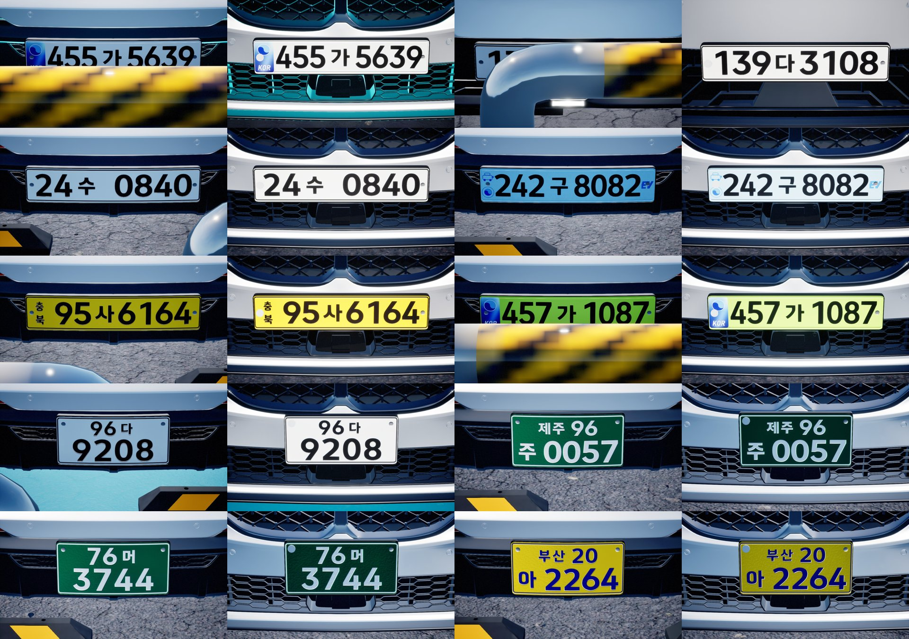
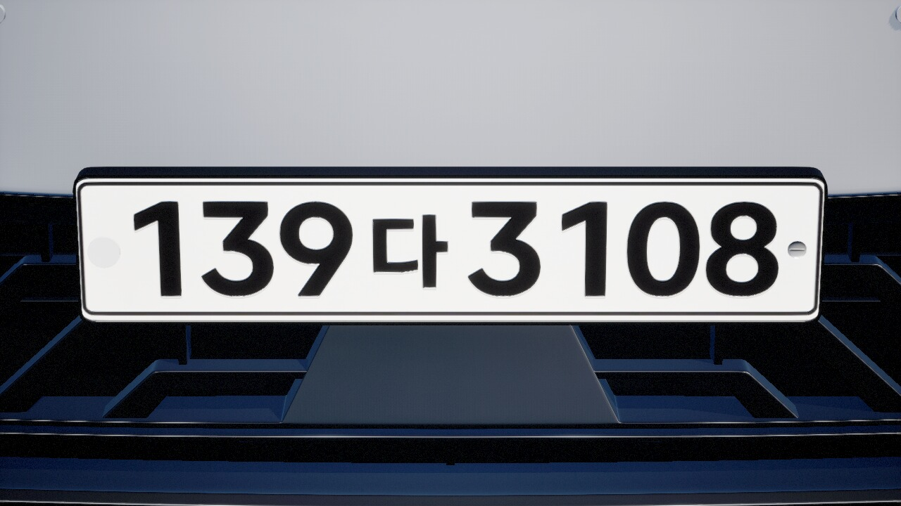
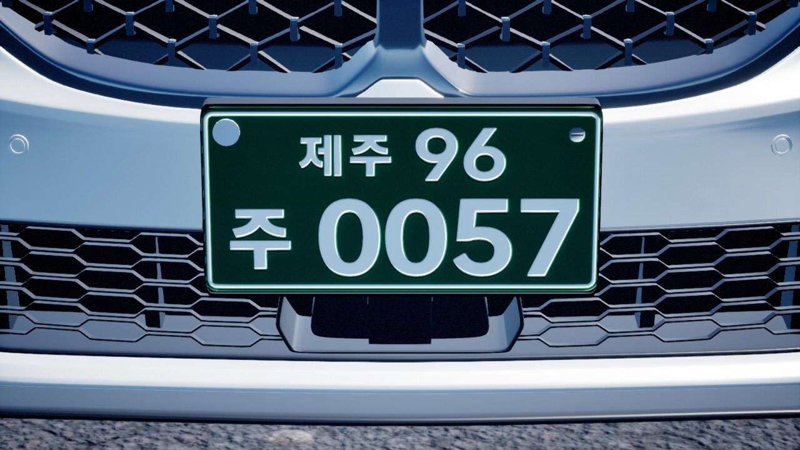
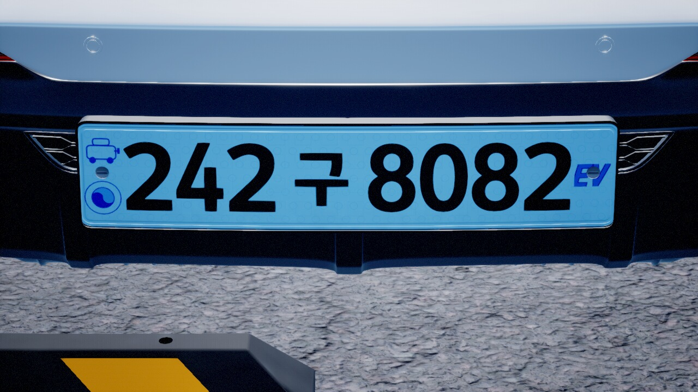
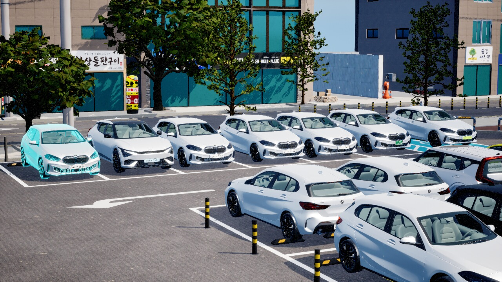
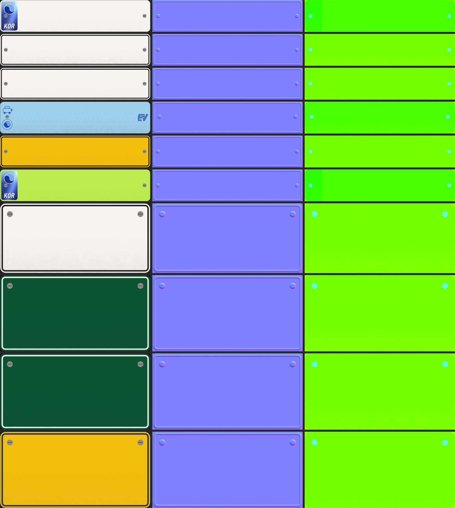

# 번호판 종류 10종 — OmiPark3D 번호판을 언리얼로 이식(바탕 텍스처·머티리얼·조판) + 차량마다 랜덤 부착

작성 2026-09-21 20:30 · 브랜치 `feat/plate-kinds` · 선행 [SDF 번호판](20260827_180238_번호판_양각_SDF_머티리얼_전환_구현.md) ·
[OmiPark3D RPC 이식](20260921_160000_Omniverse_차량_USD_재임포트_및_RPC_이식.md)

> 요청: ① `D:\Work2\Omnivers\OmniversPark3D` 의 번호판 오브젝트·텍스처·재질을 언리얼 버전으로 변환해 Content 로 옮기고
> ② 여러 타입의 번호판이 차량에 랜덤으로 붙게 할 것.



| | |
|---|---|
|  페인트식 8자리 — 양각·테두리 비드·볼트·좌측 봉인 캡 |  구형 자가용 지역판(335×170 두 줄) |
|  전기차판(충전 픽토그램·태극마크·EV·워터마크) |  랜덤 부착 후 카메라 1 조감 |

---

## 1. 옴니버스 쪽에 "번호판 오브젝트"는 어떻게 생겼나 — 그리고 왜 그대로 못 옮기나

OmiPark3D 의 번호판은 에셋이 아니라 **코드가 매번 만드는 것**이다(`docs/20260905_203000_차량_번호판_구현_보고.md`).

| 옴니버스 | 내용 |
|---|---|
| `world/plates.py` | 종류 표 10종(크기 mm·바탕/글자색·필름/페인트·지역·자릿수·허용 한글) · 번호 문법 · 종류별 표시 정규화 · 결정적/무작위 종류 배정 |
| `plategen.py` | 텍스처 베이커. (종류, **번호**, 시드) → BaseColor·Normal·ORM PNG 3장. 조판(고시 별표 mm) · 띠/태극/KOR/EV 마크 · 글자를 PIL 로 찍고, 높이장 → 노멀(양각 1.45 mm) · ORM · 노화 |
| `carassets.py plate_defs` | USD 박스 메시(판 1 mm) + 홀더(사방 12.5 mm 큰 검정 판) + 뒷판 봉인 원판(Ø22.6) + `UsdPreviewSurface` 4종(판·모서리·홀더·봉인) |

즉 **번호마다 텍스처가 다르다**(글자가 텍스처에 박혀 있다). 언리얼은 파이썬·PIL 이 런타임에 없고, 번호는 랜덤 배치마다 바뀐다
(`car.randomizePlates`). 그래서 옴니버스 PNG 를 그대로 가져오는 것은 답이 아니다.

언리얼 쪽에는 이미 **글자를 런타임에 그리는 길**이 있었다 — 글리프 SDF 아틀라스(`UPlateGlyphAtlasSubsystem`)와
`M_PlateFront` 의 SDF 릴리프(2026-08-27). 다만 종류가 하나(흰 바탕 + KOR 띠 = `normal_film`)뿐이었고, 9/21 오전에 이식한
`plate.*`/`car.setPlate` 의 종류 표는 **데이터로만** 있었다(`rendered:false`).

그래서 나눴다: **글자를 뺀 바탕(띠·마크·비드·볼트·노화)은 옴니버스 코드로 종류당 한 번 굽고, 글자는 언리얼이 종류별 조판으로 런타임에 얹는다.**

## 2. 무엇이 생겼나

### 2.1 텍스처·머티리얼 (언리얼 Content — git 미추적, 스크립트로 재생성)

```
python Tools/plate_kinds/run_build_assets.py --bake
```

| 에셋 | 내용 |
|---|---|
| `/Game/Actors/Car/Plates/Textures/Kinds/T_Plate_<kind>_{Base,Normal,ORM}` (30장) | 종류별 바탕. 한 줄 판 2048×512, 두 줄 판 1024×512 |
| `/Game/Actors/Car/Plates/Materials/M_PlateKind` | 종류 공용 부모. 바탕 3장 + `NumberSDF` 릴리프(기존 M_PlateFront 의 HLSL 그대로) + `Emboss` 스위치 + Substrate Slab |
| `/Game/Actors/Car/Plates/Materials/Kinds/MI_Plate_<kind>` (10개) | 종류별 인스턴스 — 텍스처 3장, `InkColor`(글자색), `Emboss`(필름식 0 / 페인트식 1) |

| 스크립트 | 역할 |
|---|---|
| `Tools/plate_kinds/bake_plate_kinds.py` | OmiPark3D `plategen.py` 를 **그대로 import** 해 글자 단계만 뺀 바탕을 굽는다(3 px/mm → POT 로 비등방 축소, 노멀은 축소한 높이장에서 재계산). 출력 `Tools/plate_kinds/out/<kind>_{base,normal,orm}.png` + `kinds.json`(git 추적, 3 MB) |
| `Tools/plate_kinds/build_plate_assets.py` | `UnrealEditor-Cmd -run=pythonscript` 안에서 텍스처 임포트 + 머티리얼 그래프 + MI 10개 생성·저장. **에디터 MCP 불요** |
| `Tools/plate_kinds/run_build_assets.py` | 호스트 래퍼(커맨드릿 인자 조립, 판정은 `out/_assets_report.json`) |
| `Tools/plate_kinds/shoot_plates.py` | 검증: 실행 인스턴스에 10종을 붙이고 앞·뒤 근접 촬영 + 랜덤 분포 |



### 2.2 C++

| 파일 | 내용 |
|---|---|
| `Plate/PlateKinds.{h,cpp}` (신규) | 종류 표(`FPlateKindDef` + `Band`·`Bg`·`Fg` 추가)·번호 문법·표시 정규화를 `Rpc/Modules/PlateRpcModule` 에서 **옮겼다**(차량 액터가 써야 하므로 RPC 밖으로). `AutoKindFor`(id·차종 결정적) · `RandomKindFor`(무작위, ev 는 차종 이름이 EV 일 때만) · `IsKindRendered`(MI 패키지 존재) · `KindMaterialPath` |
| `Plate/PlateLayout.{h,cpp}` (신규) | `plategen.layout()` 의 mm 조판 이식 — 한 줄(홀로그램/EV/사업용 지역 세로 2자/2의1/7자리) · 두 줄(335×155 · 335×170 지역/전국) |
| `Plate/PlateGlyphAtlas.{h,cpp}` | `BuildKindSdf(kind, shown)` — 칸마다 **잉크 높이**를 고시 mm 에 맞추고 가로는 칸 폭 [80 %(넓은 숫자), 92 %] 로 누르거나 늘린다(`_glyph_mask` 규칙). 한 줄 1024×256 · 두 줄 512×256. `Resolve(World)`(독립 아틀라스 공용 창구) · `GetKindMaterial`(MI 캐시) · 밉/텍스처 생성을 `MakeSdfTexture` 로 분리 |
| `CarActor.{h,cpp}` | `PlateKind` · `SetPlate(number, kind)` · `GetPlateDisplayText` · `IsPlateKindRendered`. 정렬에서 종류별 MI 를 앞면 슬롯에 걸고 **52×11 메시를 축마다 늘여** 335×170 등을 낸다. 뒷판 좌측 볼트 위 **봉인 캡**(`BackPlateSealComp`, 절대 스케일). MI 가 없으면(옛 패키지) 옛 판으로 폴백 |
| `CarPlacementManager.cpp` | `RandomizeVisiblePlateNumbers` 가 번호와 함께 **종류도** 뽑는다 |
| `Rpc/Modules/{Car,Plate}RpcModule.*`, `RpcModuleSupport.cpp` | `car.setPlate kind` 가 실제로 그려진다(`rendered` = 종류별 판 적용 여부, 미지정은 현재 종류 유지, `auto` 는 결정적 배정). 차량 DTO 에 `plateKind`·`plateText`. `plate.kinds` 의 `rendered` 는 MI 존재 여부. `plate.bake` 는 종류별 조판으로 굽고 base 미리보기는 종류 색으로 |
| `Tools/plate_sdf/bake_glyph_sdf.py`, `Save/Config/plate_glyph_{sdf.png,metrics.json}` | 글리프 44 → **65자**(대여 하허호 · 사업용 아 · 지역명 17곳 한글) + 글자별 **잉크 상자** 4값. 폰트는 `Tools/plate_sdf/fonts/suseong_dotum.ttf`(옴니버스가 우리 uasset 에서 뽑아 둔 TTF 를 되가져옴) |
| `Config/DefaultGame.ini` | `+DirectoriesToAlwaysCook=/Game/Actors/Car/Plates` — MI 를 문자열 경로로 LoadObject 하므로 참조가 없다(차량 메시·SDF 아틀라스 때와 같은 함정) |
| `Tests/PlateKindsTest.cpp` (신규), `CarActorTest.cpp`, `CarPlateRpcExtTest.cpp` | 배정 결정성/EV/트럭 · 10종 조판(판 안·겹침 없음·글자 수) · 10종 SDF 합성 · 종류별 판 적용·크기·봉인 |

### 2.3 랜덤 부착 규칙

- **시작 시**: 차량 id 해시로 결정적 배정(`AutoKindFor`) — 같은 파일을 다시 열어도 같은 차가 같은 판(번호와 같은 계약).
  가중치 `normal_film 40 · normal_paint7 20 · normal_paint8 15 · short_white 5 · corporate 5 · commercial 5 · old_green_national 4 · old_green_region 3 · old_business 3`,
  차종 이름에 EV/아이오닉/IONIQ → `ev`, 봉고·트럭은 50 % 사업용. (서신 23대 실측: 7종으로 퍼짐)
- **랜덤 배치**(`car.resetRandom` 재생성 모드 · `car.randomizePlates`): 번호와 함께 종류도 새로 뽑는다(seed 재현). 위 표 + `ev 8`, 단 ev 는 EV 이름 차에만.
- **RPC**: `car.setPlate {carNameId, kind:"old_green_region"|"random"|"auto", plate?}`. 지역명·사업용 한글은 표시 규칙이 seed(id) 로 채운다 — `395라6164` + commercial → `충북 95사 6164`.

## 3. 검증

| 단계 | 결과 |
|---|---|
| 아틀라스 재굽기 | 65 글리프, 1536×2816, 212 KB. 잉크 상자 65/65 |
| 바탕 텍스처 | 10종 × 3장, 커맨드릿 임포트 30/30 · MI 10/10 (`_assets_report.json`) |
| 빌드 | `Park3DEditor`·`Park3D` Win64 Development **Succeeded** |
| Automation | `StartsWith:Park3D` **131/131**(기존 128 + 신규 3). 1차 129/131 — `CarPlacement.PlateNumber`(슬롯 1 이 이제 M_PlateKind)·`CarModuleExt.SetPlate`(rendered 는 판을 정렬한 뒤에만 참) 기대값 수정 후 통과 |
| 실기 | `UnrealEditor.exe -game -RpcPort=13530`(정본 13510 무간섭). `car.setPlate` 10종 전부 `rendered:true applied:true`, 앞·뒤 20장 캡처(위 시트) — 홀로그램 띠·KOR·EV 마크·워터마크·세로 지역명·두 줄 조판·녹색/노랑 바탕·봉인 캡·양각 전부 화면으로 확인. `car.randomizePlates seed 5` → 23대가 9종으로 |

## 4. 함정 (실측)

1. **`TC_MASKS` 텍스처는 샘플러도 Masks 여야 한다.** ORM 을 `LinearColor` 샘플러로 두니 NullRHI 커맨드릿에선 조용히 저장되고
   게임에서 `Sampler type is Linear Color, should be Masks` 로 컴파일이 실패해 **판 전체가 기본 체커**로 나왔다. 커맨드릿의 `recompile_material`
   성공은 셰이더 컴파일의 증거가 아니다 — 판정은 실행 로그의 `Failed to compile Material` 줄로.
2. **파이썬 `MaterialEditingLibrary.connect_material_expressions` 는 `TextureObjectParameter → TextureProperty.TextureObject` 를 못 잇는다**
   (False). 텍셀 크기는 HLSL 에서 `Tex.GetDimensions()` 로 직접 잰다 — 덕분에 SDF 크기가 종류마다 달라도 머티리얼 하나다.
3. **NPOT 텍스처는 밉이 안 생긴다** → 3 px/mm(1560×330)로 굽고 2048×512 로 비등방 축소. 노멀은 이미지를 줄이지 말고 **높이장을 줄여 다시 계산**한다(가로/세로 px/mm 이 다르다).
4. 두 줄 판은 52×11 메시를 축마다 늘인다 → 자식 컴포넌트가 스케일을 물려받는다. 봉인 캡은 `SetAbsolute(scale)` 로 빼야 원판이 타원이 안 된다.
5. `bPlateKindRendered` 는 판을 실제로 정렬한 뒤에만 참 — 메시 없는 테스트 차량은 `rendered:false` 가 맞다. 테스트는 "참이면 에셋이 있다"로.
6. 종류 변경은 옛 MID 에 텍스처만 갈면 바탕이 옛 종류로 남는다 → MID 를 버리고 정렬을 다시 돌린다(`SetPlate`).
7. 아틀라스 글자 배치를 **어드밴스 박스 → 잉크 상자**로 바꿔야 한글이 고시 높이(57/85)로 줄어든다. 옛 메트릭(잉크 상자 없음)은 캡 높이로 근사해 여전히 읽힌다.

## 5. 한계 · 미검증

- **패키지 재쿡 필요** — 새 텍스처·머티리얼은 pak 에 없다. `Package/Windows`(정본)·`Work13520` 은 exe 만 갈면 MI 를 못 찾아 **옛 판(흰 필름식)으로 폴백**한다(로그 `[PlateSDF] 종류 머티리얼 없음`). `DirectoriesToAlwaysCook` 을 넣었으므로 다음 `BuildPackage.bat` 에서 들어간다. 쿠킹된 패키지에서의 화면은 미검증.
- 옴니버스 판 홀더(판보다 사방 12.5 mm 큰 검정 판)는 기존 `SM_Plate_F/B` 의 테두리(M_PlateFrame)가 그 역할이라 따로 만들지 않았다. 판 모서리(EdgeMat)도 메시 테두리가 대신한다.
- 숫자 서체는 언리얼 아틀라스대로 수성돋움체(옴니버스는 Bahnschrift). 획 굵히기(0.3 mm)는 SDF 임계로 대신하지 않았다.
- 원거리(판 50 px 이하)에서 두 줄 판·지역 세로 2자의 판독은 안 쟀다.
- `plate.bake map=base` 미리보기는 바탕 텍스처(볼트·띠 그림) 없이 종류 색만 칠한다.
